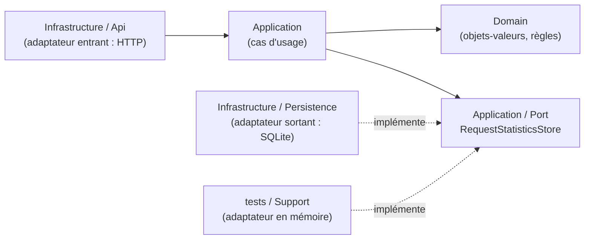
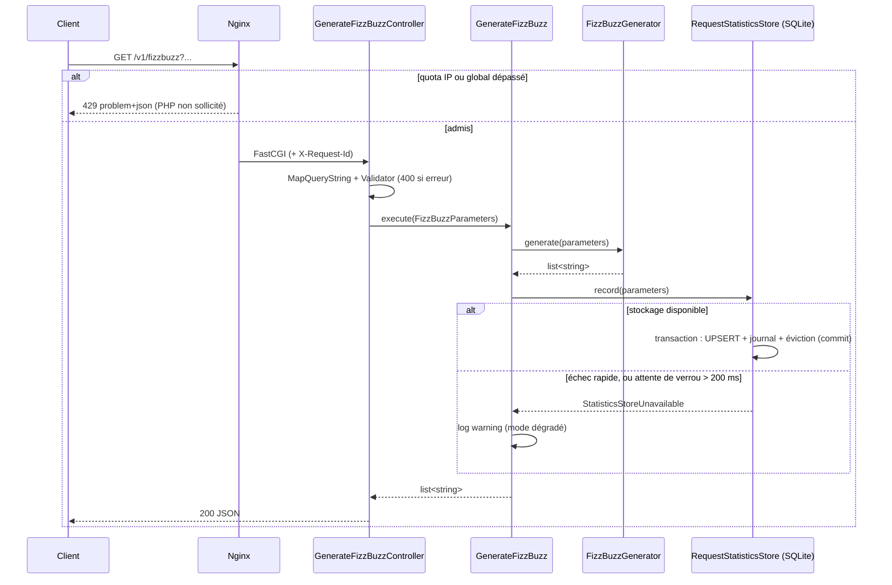

# FizzBuzz API — Spécification technique

> Statut : **prête pour relecture finale**, corrigée après la review du 2026-09-12 (`docs/review-corrections.md`). Aucune ligne de code applicatif écrite.
> Date : 2026-09-12 · Stack : PHP 8.5 / Symfony 8.1 / SQLite / Nginx + PHP-FPM · Architecture : DDD, hexagonale, SOLID

### Qualification des affirmations

Chaque chiffre ou comportement annoncé dans ce document relève de l'une de ces catégories :

| Étiquette | Signification |
|---|---|
| **[source]** | comportement vérifié dans le code source ou la documentation officielle de l'outil, pour la version indiquée |
| **[mesure]** | mesure locale reproductible : script et sortie complète dans `docs/benchmarks/` (machine de développement, limites dans son README) |
| **[objectif]** | seuil à atteindre et à démontrer par un test futur ; ce n'est pas un résultat |
| **[hypothèse]** | estimation ou dimensionnement à qualifier sur l'infrastructure cible |

Aucune garantie de production n'est annoncée au-delà de ce que ces éléments démontrent.

---

## 1. Contexte, objectifs et cadre

L'objectif est d'exposer une API REST qui génère une suite FizzBuzz paramétrable, ainsi qu'un endpoint de statistiques qui renvoie la requête la plus fréquente.

L'énoncé impose deux exigences non fonctionnelles. Ce projet sert aussi de **démonstration de pratiques de conception**.

| Exigence | Traduction concrète |
|---|---|
| **Prêt pour la production** | validation stricte des entrées, erreurs standardisées, bornes contre les abus, rate limiting avant PHP, stockage borné et persistant, mode dégradé, images Docker durcies, healthcheck, logs structurés et corrélés, CI |
| **Facile à maintenir par d'autres développeurs** | modèle métier explicite (DDD), frontières techniques nettes (hexagonal), principes SOLID, règles de dépendances vérifiées automatiquement, code typé et analysé statiquement, tests lisibles, README et contrat OpenAPI |
| **Démonstration de pratiques** *(objectif propre)* | chaque pattern employé a un rôle concret. Rien n'est ajouté pour « faire DDD » (§5.9) ; les patterns étudiés puis écartés sont documentés avec leur justification (§15) |

Principe directeur : **le plus simple qui tienne en production, dans le cadre d'une architecture explicite**.

> **Cadre de ce document.** Le périmètre est **volontairement limité** et n'est pas exhaustif. Tel que spécifié, le service vise une **instance unique à trafic modéré**. Ce qu'il faudrait ajouter pour un service critique ou à fort trafic est listé en **§14 Ouvertures**. Les alternatives étudiées puis écartées figurent en **§15**.

### 1.1 Couverture de l'énoncé

| Exigence de l'énoncé | Réponse | Sections |
|---|---|---|
| 5 paramètres : `int1`, `int2`, `limit`, `str1`, `str2` | `GET /v1/fizzbuzz`, `#[MapQueryString]` + DTO validé, objet-valeur métier | §3.3, §4.1, §5.7 |
| Liste de 1 à `limit` avec remplacement des multiples | service de domaine `FizzBuzzGenerator` | §3.1, §3.2 |
| Prêt pour la production | exigences qualifiées, validation, RFC 9457, rate limiting, mode dégradé, Docker, logs, CI | §1.2, §4.4, §5.10, §7, §8, §11 |
| Facile à maintenir | DDD, hexagonal, SOLID, Deptrac, PHPStan, tests par couche | §5, §9, §10 |
| **Bonus** : endpoint de statistiques sans paramètre | `GET /v1/stats` | §4.2 |
| **Bonus** : paramètres de la requête la plus utilisée **et** nombre de hits | compteurs SQLite sur une **fenêtre glissante des N derniers appels** | §3.4, §6 |

**Restriction assumée** : les statistiques portent sur les **N derniers appels comptabilisés** (N = 100 000 par défaut), et non sur tout l'historique. Ce choix borne le **nombre de lignes** stockées (§6.1). Il est visible dans la réponse (`window`), dans l'OpenAPI et dans le README. Ce n'est pas une exigence de l'énoncé.

**Ajouts hors énoncé**, justifiés par « prêt pour la production » : `/healthz`, rate limiting, mode dégradé, logs structurés, contrat OpenAPI, préfixe `/v1`.

### 1.2 Exigences non fonctionnelles

| Exigence | Valeur | Nature et garantie |
|---|---|---|
| Débit admis | ≤ **10 req/s** au total, ≤ **1 req/s par IP** (rafale de 3) | configuration Nginx, algorithme **[source]** ; effectivité à vérifier par le smoke test (§9.1) |
| Taille d'une requête | URL ≤ 8 Ko, corps ≤ 1 Ko | configuration Nginx |
| Taille d'une réponse | ≤ **6,03 Mo** non compressée au pire cas retenu, ~22 Ko compressée | **[mesure]** de l'encodage seul (§3.3) |
| Mémoire | génération + encodage JSON ≤ **14,1 Mo** au pire cas retenu | **[mesure]** en PHP CLI. La mémoire **totale** d'une requête Symfony / PHP-FPM n'est pas mesurée : **[objectif]** à qualifier (§9.4) |
| Stockage des statistiques | **borne logique** : au plus N occurrences et N combinaisons après chaque transaction, à N constant | par construction ; invariants vérifiés **[mesure]** (§6.3) |
| | **volume physique** : 10,9 Mo (chaînes courtes) à **101 Mo** (pire cas : 2 × 50 emojis, combinaisons toutes distinctes) pour N = 100 000 | **[mesure]** (§6.1) |
| | **budget disque** : volume de 500 Mo minimum, alerte à 70 % | **[hypothèse]** : tables, index, pages libres, WAL et marge (§6.5) |
| Disponibilité de la génération | **une fois l'instance démarrée**, la génération est servie même si l'enregistrement des statistiques échoue ; **au démarrage**, l'instance ne démarre pas si SQLite est inaccessible | mode dégradé (§5.10), séquence de démarrage (§7.6) |
| Attente sur verrou SQLite | configurée à **200 ms** | **[source]** : borne l'attente d'un verrou, **pas** la durée totale d'une écriture (entrées-sorties, synchronisation) |
| Bornes de traitement | PHP-FPM coupe une requête à **10 s**, Nginx abandonne à **15 s** | configuration (§7.3, §7.5) |
| Latence | p95 < 50 ms à 10 req/s pour `limit ≤ 100` | **[objectif]** à démontrer par le test de charge k6 (§9.4) |
| Arrêt propre | PHP-FPM termine les requêtes en cours (`STOPSIGNAL SIGQUIT`) | **[source]** : Dockerfile de l'image officielle |

---

## 2. Décisions (récapitulatif)

| # | Sujet | Décision | Statut |
|---|---|---|---|
| D1 | Langage / framework | PHP 8.5, Symfony 8.1 (skeleton API) | ✅ validé |
| D2 | Stockage des stats | SQLite sur volume persistant | ✅ validé |
| D3 | Forme de l'API | `GET` + query params, réponse JSON | ✅ validé |
| D4 | Livrables | Dockerfile, Makefile, CI GitHub Actions, OpenAPI, observabilité | ✅ validé |
| D5 | Serveur applicatif | Nginx + PHP-FPM, 2 conteneurs ; FrankenPHP étudié puis écarté (§15.4) | ✅ validé |
| D6 | Observabilité | logs JSON corrélés + `/healthz` ; politique de confidentialité des logs (§8.1) ; métriques en ouverture (§14) | ✅ validé |
| D7 | Architecture | **DDD + hexagonale + SOLID**, règles de dépendances vérifiées par Deptrac | ✅ validé |
| D8 | Sémantique des stats | **fenêtre glissante des N derniers appels**, N configurable (100 000 par défaut) | ✅ validé |
| D9 | Accès aux stats | **public, choix documenté** ; authentification en ouverture (§14.1) | ✅ validé |
| D10 | Rate limiting | Nginx : 1 req/s par IP (burst 2) et 10 req/s au total (burst 10), paramétrables, réponse 429 | ✅ validé |
| D11 | Accès base de données | Doctrine DBAL + Migrations, sans ORM | ✅ validé |
| D12 | Lecture des paramètres HTTP | `#[MapQueryString]` natif + DTO + Validator (§5.7) | ✅ validé |
| D13 | Format des erreurs | RFC 9457 `application/problem+json` ; **400** pour toute erreur de paramètres, avec la liste des violations, documenté dans l'OpenAPI | ✅ validé |
| D14 | Versioning | préfixe `/v1`, politique d'évolution en §4.5 | ✅ validé |
| D15 | Résilience | mode dégradé + attente de verrou 200 ms ; circuit breaker étudié puis écarté (§15.5) | ✅ validé |
| D16 | Démarrage | migrations, puis application de la taille de fenêtre, puis PHP-FPM ; **échec du démarrage si SQLite est inaccessible** (§7.6) | ✅ validé |

Les décisions de détail sont regroupées en §13.

---

## 3. Spécification fonctionnelle

### 3.1 Algorithme

Pour chaque `i` de `1` à `limit` :

```
correspondance = faux ; s = ""
si i % int1 == 0 : s .= str1 ; correspondance = vrai
si i % int2 == 0 : s .= str2 ; correspondance = vrai
résultat[i] = correspondance ? s : (string) i
```

- **Deux tests indépendants**, sans PPCM ni produit des diviseurs. Avec `int1 = 2` et `int2 = 4`, le nombre 4 produit bien `str1str2`, sans supposer que les diviseurs sont premiers entre eux.
- **On note s'il y a eu correspondance** au lieu de tester si la chaîne produite est vide ou fausse. On évite ainsi le piège PHP de `"0"` évalué comme faux, et le domaine reste correct pour une chaîne vide, même si l'API la refuse (§3.3).
- **Complexité** : O(`limit`) en temps et en mémoire. Pas de streaming nécessaire avec `limit ≤ 10 000` (§14.3).

### 3.2 Cas limites (tous testés)

| Entrée (`int1, int2, limit, str1, str2`) | Résultat attendu |
|---|---|
| `3, 5, 15, fizz, buzz` | `1,2,fizz,4,buzz,fizz,7,8,fizz,buzz,11,fizz,13,14,fizzbuzz` |
| `2, 4, 8, a, b` | `1,a,3,ab,5,a,7,ab` (diviseurs non premiers entre eux) |
| `3, 5, 6, "", buzz` *(domaine uniquement, refusé par l'API)* | `1,2,"",4,buzz,""` (chaîne vide ≠ absence de correspondance) |
| `int1 == int2` | chaque multiple donne `str1str2` |
| `int1 = 1` | chaque élément vaut `str1` ou `str1str2` |
| diviseurs supérieurs à `limit` | uniquement des nombres |
| `limit = 1` | `["1"]` (ou `str1` si `int1 = 1`) |
| `str1 = "0"` | `"0"`, et non le nombre |
| `str1 = " "` (une espace) | `" "` : l'espace est une valeur valide |
| `str1 == str2` | autorisé (`abab`) |
| Unicode (`🍕`, `é`) | renvoyé tel quel, sans échappement JSON (§3.3) |

### 3.3 Contrat des paramètres

Les 5 paramètres sont **obligatoires** et **non vides**, sans valeur par défaut.

| Paramètre | Règle | Raison |
|---|---|---|
| `int1`, `int2` | entier décimal, `1 ≤ n ≤ 2 147 483 647` | 0 = division par zéro ; la borne haute rejette aussi les valeurs tronquées (ci-dessous) |
| `limit` | entier décimal, `1 ≤ limit ≤ 10 000` | borne le calcul et la taille de réponse |
| `str1`, `str2` | chaîne UTF-8 de **1 à 50 points de code**, **sans aucun caractère de contrôle**, y compris en fin de chaîne ; espaces et `"0"` autorisés | borne la taille de réponse ; une chaîne vide est refusée (Q8) |

#### Erreurs : un seul code, 400 (D13)

Toute erreur sur les paramètres renvoie **400 Bad Request** en problem+json, avec la liste des `violations` : chaque entrée donne le champ concerné (`propertyPath`) et un message lisible (`title`). Ce choix est **documenté dans l'OpenAPI**. Il privilégie la simplicité du mécanisme natif (§5.7) plutôt qu'une distinction 400 / 422 que l'énoncé n'exige pas.

Il existe deux familles d'erreurs, au comportement différent :

| Famille | Exemples | Message | Erreurs remontées |
|---|---|---|---|
| **Conversion** : la valeur ne peut pas devenir un entier | `int1=abc`, `int1=3.5`, `int1[]=3` | message générique de Symfony : « This value should be of type int. » | **uniquement les erreurs de conversion** : Symfony n'exécute la validation que si toutes les conversions ont réussi **[source]** |
| **Validation** : la valeur est lisible mais enfreint une règle | paramètre absent ou vide, hors bornes, trop long, caractère de contrôle | message de la contrainte ; pour un paramètre absent ou vide : « This parameter is required and must not be empty. » | **toutes les violations d'un coup** |

Exemple : `GET /v1/fizzbuzz?int1=3&int2=5&limit=0&str2=buzz`

```json
{
  "type": "https://symfony.com/errors/validation",
  "title": "Validation Failed",
  "status": 400,
  "detail": "limit: This value should be between 1 and 10000.\nstr1: This parameter is required and must not be empty.",
  "violations": [
    { "propertyPath": "limit", "title": "This value should be between 1 and 10000." },
    { "propertyPath": "str1", "title": "This parameter is required and must not be empty." }
  ]
}
```

*(Les champs `template`, `parameters` et `type` de chaque violation sont omis pour la lisibilité.)*

#### Comportement exact par entrée

Chaque ligne relève d'un comportement **[source]** de Symfony 8.1.6 ou d'une **[mesure]** en PHP 8.5.2, et fera l'objet d'un test fonctionnel (§9.1).

| Entrée | Famille | Réponse |
|---|---|---|
| `int1=3`, `int1=03` | — | 200 ; `03` vaut 3 (même combinaison statistique) |
| `int1` absent | validation | 400 « This parameter is required and must not be empty. » (`NotNull`) |
| `int1=` (vide) | validation | 400, même message : pour un entier nullable, `''` est converti en `null` **[source]** |
| `abc`, `3.5`, `+3`, ` 3`, `3e2`, `int1[]=3` | conversion | 400 « This value should be of type int. » |
| `-3`, `0`, `limit=10001` | validation | 400 (bornes) |
| `int1=99999999999999999999` | validation | 400 (bornes). Symfony convertit d'abord la valeur en `PHP_INT_MAX`, puis la borne haute la rejette : aucune valeur tronquée n'est acceptée |
| `int1=3&int1=4` | — | la **dernière valeur** l'emporte (analyse standard de la query string par PHP) ; déconseillé et documenté |
| `str1` absent | validation | 400 « This parameter is required and must not be empty. » (`NotBlank`) |
| `str1=` (vide) | validation | 400, même message. Pour une chaîne, `''` est **conservé** par le serializer **[source]** : c'est `NotBlank` qui le refuse |
| `str1=0`, `str1=%20` (espace) | — | **200** : `NotBlank` accepte `"0"` et `" "` **[source]** |
| `str1=fizz%0A` (saut de ligne final) | validation | 400. Avec l'ancre PCRE `$`, cette valeur passerait **[mesure]** : la regex utilise l'ancre de fin stricte `\z` |
| `fi%0Azz`, `%0D`, `%09`, `%00` | validation | 400 (caractère de contrôle) |
| `str1[]=a` | conversion | 400 « This value should be of type string. » |
| 51 points de code, UTF-8 invalide (`%FF`) | validation | 400 |
| aucun paramètre | validation | 400, avec les 5 violations |

#### Chaînes longues : comment la borne est fixée

Le critère retenu est le **pire cas de réponse** : `limit` éléments valant chacun `str1str2`, quand `int1 = int2 = 1`.

**Unité de mesure** (option `countUnit` de la contrainte `Length`) :

| Unité | `é` | `🍕` | Verdict |
|---|---|---|---|
| octets | 2 | 4 | incompréhensible pour le client |
| **points de code** (défaut Symfony) | 1 | 1 | ✅ compréhensible, et borne les octets (4 au plus par point de code). C'est aussi l'unité de `maxLength` en JSON Schema |
| graphèmes | 1 | 1 | ❌ **faille** : un seul graphème peut contenir des centaines de points de code. Texte « Zalgo » **[mesure]** : 1 graphème = 501 points de code = 1 001 octets |

**Encodage JSON.** Par défaut, Symfony échappe tous les caractères non-ASCII (`JsonResponse::DEFAULT_ENCODING_OPTIONS = 15`). **[mesure]**, en octets :

| Caractère | UTF-8 | JSON par défaut | JSON + `JSON_UNESCAPED_UNICODE` |
|---|---|---|---|
| `a` | 1 | 1 | 1 |
| `é` | 2 | 6 (`\u00e9`) | 2 |
| `<` `>` `&` `'` `"` | 1 | 6 | 6 (échappement conservé, protection XSS) |
| `🍕` | 4 | **12** (`\ud83c\udf55`) | 4 |

→ **Décision** : encoder avec `JsonResponse::DEFAULT_ENCODING_OPTIONS | JSON_UNESCAPED_UNICODE | JSON_THROW_ON_ERROR`.

**Pièges d'implémentation** **[source]** :
- `AbstractController::json()` impose explicitement les options par défaut, ce qui **écrase** toute configuration globale du serializer.
- `JsonResponse::setEncodingOptions()` appelée après le constructeur **décode puis ré-encode** les données.
- → Les contrôleurs encodent **une seule fois** avec `json_encode(..., flags)` puis `JsonResponse::fromJsonString()`.

**Pire cas** (`limit = 10 000`) **[mesure]**, script `03-json-reponse.php`. Le périmètre couvre la génération et `json_encode`, **pas** la mémoire totale d'une requête Symfony :

| Bornes | Contenu | JSON | Mémoire (génération + encodage) | gzip |
|---|---|---|---|---|
| 100 points de code, options par défaut | 🍕 | 24,03 Mo | 58,1 Mo | 66,8 Ko |
| 50 points de code, options par défaut | 🍕 | 12,03 Mo | 29,4 Mo | 42,1 Ko |
| **50 points de code + `JSON_UNESCAPED_UNICODE`** *(retenu)* | 🍕 | **4,03 Mo** | 13,3 Mo | 21,3 Ko |
| *idem, pire cas absolu* | `"` | **6,03 Mo** | 14,1 Mo | 21,9 Ko |
| *idem, cas réaliste* | `a` | 1,03 Mo | 4,0 Mo | 3,5 Ko |

Le risque principal est l'**amplification** : une requête d'environ 1 Ko peut produire 6 Mo de réponse. Il est traité par le rate limiting (§7.4) et gzip (§7.3).

**Défense en profondeur :**
- **Nginx** : URL de plus de 8 Ko → 414 avant PHP. Une requête valide pèse au plus ~1,3 Ko.
- **Validator** : `NotBlank`, `Length` en points de code avec rejet de l'UTF-8 invalide, `Regex('/^\P{Cc}+\z/u')` contre les caractères de contrôle.
- **OpenAPI** : `minLength: 1`, `maxLength: 50` et `pattern: '^\P{Cc}+$'`. En JSON Schema (syntaxe ECMA-262), `$` n'accepte pas de saut de ligne final : l'expression diffère de celle de PHP, mais **la règle fonctionnelle est identique**.
- **SQLite n'applique pas** la longueur déclarée des colonnes `VARCHAR` : la validation applicative est le seul garde-fou avant la base.

### 3.4 Statistiques : fenêtre glissante

- **Définition** : `/v1/stats` renvoie la combinaison la plus fréquente **parmi les N derniers appels comptabilisés**, avec son nombre de hits dans cette fenêtre.
- **Identité d'une combinaison** : le quintuplet **typé** `(int1, int2, limit, str1, str2)`.
  - L'ordre des paramètres dans l'URL n'a pas d'incidence, et `03` et `3` désignent la même combinaison.
  - Les chaînes sont comparées octet par octet : sensibles à la casse et aux espaces, sans normalisation Unicode.
- **Ce qui est comptabilisé** : un `GET /v1/fizzbuzz` valide dont la génération a abouti **et** dont l'enregistrement a été confirmé (commit), **avant** l'envoi de la réponse.
- **Ce qui ne l'est pas** : les `HEAD`, les 400, 413, 414 et 429, les appels à `/v1/stats` et `/healthz`, et les appels servis **en mode dégradé** (§5.10).
- **Cas indéterminés (500, 502, 504, coupure réseau)** : l'échec peut survenir **avant** ou **après** le commit. Dans le second cas, l'appel est compté alors que le client reçoit une erreur. **Le client ne peut pas le déterminer** à partir du seul statut, et une nouvelle tentative est comptée comme un nouvel appel : aucune déduplication, aucune garantie « exactement une fois ».
- **Conséquence du mode dégradé** : pendant une panne du stockage, les statistiques **sous-estiment** l'activité. Il n'y a aucune réconciliation : la fenêtre se corrige d'elle-même après N nouveaux appels comptabilisés (§5.10).
- **Exemple avec N = 3** : les appels A, A, B donnent A = 2 et B = 1. L'arrivée de C fait sortir le premier A : la fenêtre devient A, B, C, avec trois compteurs à 1. Cette baisse est le comportement attendu d'une mesure d'activité récente.
- **Égalité de hits (départage)** : on renvoie la combinaison **présente dans la fenêtre depuis le plus longtemps**, c'est-à-dire la plus petite `id`. Avec N = 4 et les appels A, B, B, A, A et B ont 2 hits chacune : **A est renvoyée**. Une combinaison sortie entièrement de la fenêtre puis revenue est considérée comme nouvelle. Ce choix rend la réponse **déterministe**.
- **Cohérence** : `window.count ≤ window.size` à tout moment, y compris juste après une réduction de N (§6.6).
- **Fenêtre vide** : `200` avec `request: null`, `hits: 0` et les métadonnées de fenêtre (§4.2).

### 3.5 Requêtes `HEAD`

Symfony traite `HEAD` comme `GET` **[source]**. Sans précaution, un `HEAD` incrémenterait les statistiques.

- `HEAD /v1/fizzbuzz` **lit et valide les paramètres** avec les mêmes codes, sans corps, **sans générer ni comptabiliser**.
- `HEAD /v1/stats` et `HEAD /healthz` renvoient les mêmes statuts et en-têtes que leur `GET`, sans corps. Pour `/healthz`, le statut `degraded`, porté par le corps, n'est pas visible en `HEAD`.
- Les erreurs, y compris celles produites par Nginx, n'ont **jamais** de corps en réponse à un `HEAD`.

---

## 4. Contrat d'API

Le contrat de référence est `docs/openapi.yaml` (OpenAPI 3.1), rédigé **avant** le code. En cas d'écart, c'est lui qui fait foi et le code est corrigé.

### 4.1 `GET /v1/fizzbuzz`

```http
GET /v1/fizzbuzz?int1=3&int2=5&limit=15&str1=fizz&str2=buzz

HTTP/1.1 200 OK
Content-Type: application/json
Cache-Control: no-store
X-Request-Id: 5f0c3a9e1b7d4e2a8c6f0b1d2e3a4b5c

["1","2","fizz","4","buzz","fizz","7","8","fizz","buzz","11","fizz","13","14","fizzbuzz"]
```

- `Cache-Control: no-store` est **indispensable** : une réponse servie par un cache ne passerait plus par le comptage. Il est posé par Nginx sur **toutes** les réponses (§7.3).
- **Un GET qui compte, est-ce acceptable ?** Oui. La RFC 9110 définit une méthode « sûre » par ce que **le client demande**, pas par l'absence d'effets côté serveur : un journal d'accès ou un compteur d'audience sont admis. Le client demande une représentation calculée ; le comptage est un effet d'observation. Conséquences assumées et documentées : les répétitions sont comptées, sans clé d'idempotence (§3.4).

### 4.2 `GET /v1/stats`

Aucun paramètre accepté ; ceux fournis sont ignorés.

```http
HTTP/1.1 200 OK
Content-Type: application/json
Cache-Control: no-store

{
  "request": { "int1": 3, "int2": 5, "limit": 100, "str1": "fizz", "str2": "buzz" },
  "hits": 42,
  "window": { "type": "last_requests", "size": 100000, "count": 100000 }
}
```

- `hits` : occurrences de la combinaison **dans la fenêtre**, et non depuis l'origine.
- `window.size` : N configuré. `window.count` : nombre d'appels actuellement retenus, **toujours inférieur ou égal à `size`**.
- **Fenêtre vide** : `{"request": null, "hits": 0, "window": {"type": "last_requests", "size": 100000, "count": 0}}`. On garde un `200` avec corps plutôt qu'un `204`, pour que la sémantique de fenêtre reste visible.

**Accès public, choix assumé et documenté** (D9) : la réponse expose des chaînes fournies par d'autres clients. L'OpenAPI et le README préviennent donc les clients de **ne jamais y transmettre de données sensibles**. Protéger cet endpoint relève de l'authentification, décrite en ouverture (§14.1).

### 4.3 `GET /healthz`

- **Contrôle** : l'application répond, et l'état du stockage des statistiques est vérifié en lisant les deux tables. Cette lecture prouve aussi que les migrations ont été appliquées, ce qu'un simple `SELECT 1` ne ferait pas.
- **Cohérence avec le mode dégradé** : si seul le stockage devient indisponible **après le démarrage**, le service **reste capable de générer**. `/healthz` renvoie donc `200` avec le statut `degraded`, et non `503`. Sinon, l'orchestrateur retirerait du routage une instance encore utile.

| Situation | Réponse |
|---|---|
| tout fonctionne | `200 {"status":"ok","checks":{"statistics":"ok"}}` |
| stockage indisponible après le démarrage | `200 {"status":"degraded","checks":{"statistics":"unavailable"}}` |
| PHP-FPM indisponible ou trop lent | `502` ou `504` (produits par Nginx, en problem+json) |
| SQLite inaccessible **au démarrage** | l'instance ne démarre pas : aucune réponse (§7.6) |

- **Hors quota** de rate limiting : une saturation du quota ne doit pas faire retirer une instance saine du routage.
- **Accès réservé au réseau d'exploitation**, appliqué par Nginx (`allow` / `deny`, §7.3). Depuis l'extérieur, la réponse est un `403`.
- Aucun chemin ni aucune configuration n'est divulgué.

### 4.4 Erreurs — RFC 9457

**Toutes** les erreurs sont en `application/problem+json` (sans corps en réponse à un `HEAD`), portent `X-Request-Id` et `Cache-Control: no-store`, qu'elles viennent de Symfony ou de Nginx.

| Code | Cas | Produit par | Appel comptabilisé ? |
|---|---|---|---|
| 400 | paramètre absent, vide, mal typé ou hors bornes, avec la liste des `violations` (§3.3) | Symfony (`#[MapQueryString]` + Validator) | non |
| 403 | `/healthz` appelé hors du réseau d'exploitation | Nginx | non |
| 404 / 405 | route inconnue / méthode non admise | Symfony | non |
| 413 | corps de requête > 1 Ko | Nginx | non |
| 414 | URL > 8 Ko | Nginx | non |
| 429 | quota par IP ou global dépassé, avec `Retry-After` | **Nginx, avant PHP** | non |
| 500 | erreur inattendue, sans aucun détail exposé | Symfony | **indéterminé** : oui si l'erreur survient après le commit |
| 502 / 504 | PHP-FPM indisponible / trop lent | Nginx | **indéterminé** : non si l'échec précède le traitement, oui s'il survient après le commit |
| 503 | **`GET /v1/stats` uniquement** : stockage indisponible (une lecture ne peut pas être dégradée). `/v1/fizzbuzz` ne renvoie **jamais** de 503 à cause des statistiques | Symfony (mapping d'exception natif) | — |

Exemple de réponse 400 : voir §3.3. Le client cite `X-Request-Id` au support (§8.1).

**Exception documentée** : deux rejets précoces de Nginx restent en HTML, hors contrat : un en-tête de requête de plus de 8 Ko (400, `large_client_header_buffers`) et un appel direct à une URI interne `/_errors/*` (404). Les rendre en problem+json imposerait un 400 sans `violations`, incompatible avec `ValidationProblem` ; correction envisageable plus tard (§14).

### 4.5 Politique d'évolution du contrat

- **Non cassant**, reste en `/v1` : ajout d'un champ dans une réponse, ajout d'un endpoint, ajout d'un paramètre **optionnel**. Les clients doivent **ignorer les champs inconnus**.
- **Cassant**, passe en `/v2` avec coexistence temporaire des deux versions : suppression ou renommage d'un champ, changement de type ou de sémantique (par exemple passer à des statistiques historiques), resserrement d'une borne.

---

## 5. Architecture : DDD, hexagonale, SOLID

### 5.1 Langage du domaine (DDD)

| Terme | Signification | Représentation |
|---|---|---|
| **Paramètres FizzBuzz** | les 5 valeurs d'une demande, identifiées par leurs valeurs | objet-valeur `FizzBuzzParameters` |
| **Génération** | calcul de la suite de 1 à `limit` | service de domaine `FizzBuzzGenerator` |
| **Appel comptabilisé** | génération aboutie et enregistrement confirmé | opération `RequestStatisticsStore::record()` |
| **Fenêtre** | les N derniers appels comptabilisés | configuration N + journal côté adaptateur |
| **Requête la plus fréquente** | combinaison la plus présente dans la fenêtre | modèle de lecture `RequestStatistics` |

- Un seul **module** (`FizzBuzz`) : génération et statistiques partagent le même modèle. Aucun besoin identifié de séparer deux *bounded contexts*.
- L'identifiant SQLite n'est **pas** une identité métier et ne sort jamais de la couche de persistance.

### 5.2 Couches et règle de dépendance (hexagonal)



Le schéma montre les **dépendances de code**, pas l'ordre des appels.

| Couche | Peut dépendre de | Ne doit **jamais** dépendre de |
|---|---|---|
| `Domain` | rien (PHP pur) | Symfony, Doctrine, HTTP, `Application`, `Infrastructure` |
| `Application` | `Domain`, interface PSR-3 `LoggerInterface` (un standard, pas le framework) | Symfony, Doctrine, HTTP, `Infrastructure` |
| `Infrastructure` | `Application`, `Domain`, Symfony, Doctrine | `Shared` |
| `Shared` (`src/Shared/Infrastructure/`) | Symfony, Doctrine DBAL, Monolog, interfaces PSR | `Domain`, `Application`, `Infrastructure` de `src/FizzBuzz/` |

Ces règles sont **vérifiées en CI par Deptrac** : une violation fait échouer le pipeline.

### 5.3 Composants

| Couche | Classe | Responsabilité | Ne contient pas |
|---|---|---|---|
| Domain | `FizzBuzzParameters` | objet-valeur `final readonly` : 5 valeurs typées ; invariants `int1, int2, limit ≥ 1` ; égalité par valeurs | attributs Symfony, SQL, identifiant technique |
| Domain | `FizzBuzzGenerator` | calcul pur et déterministe : `generate(FizzBuzzParameters): list<string>` | comptage, logs, I/O |
| Domain | `Exception\InvalidFizzBuzzParameters` | violation d'un invariant | statut HTTP |
| Application | `GenerateFizzBuzz` | cas d'usage : générer, puis `record()` **une seule fois** ; si le stockage est indisponible, journaliser et retourner quand même la liste | parsing HTTP, SQL, sérialisation |
| Application | `GetMostFrequentRequest` | cas d'usage : lire le top de la fenêtre | SQL, statut HTTP |
| Application | `Port\RequestStatisticsStore` | **port sortant** : `record(FizzBuzzParameters): void`, `findMostFrequent(): RequestStatistics` | types SQLite ou Symfony |
| Application | `Model\RequestStatistics` | modèle de lecture : `?FizzBuzzParameters $request`, `int $hits`, `int $windowSize`, `int $windowCount` | dépendance DBAL |
| Application | `Exception\StatisticsStoreUnavailable` | indisponibilité attendue du stockage | message SQL |
| Infrastructure | `Api\GenerateFizzBuzzController` | `#[MapQueryString]` → `FizzBuzzParameters` → cas d'usage → JSON encodé une fois ; `HEAD` sans cas d'usage | logique métier |
| Infrastructure | `Api\GetMostFrequentRequestController` | cas d'usage → JSON | SQL |
| Infrastructure | `Api\GenerateFizzBuzzQuery` | DTO HTTP `final readonly` : 5 propriétés nullables typées et leurs contraintes `#[Assert\…]` ; `toParameters()` | règle métier |
| Infrastructure | `Persistence\SqliteRequestStatisticsStore` | adaptateur SQLite : transaction de fenêtre, éviction, lecture, traduction des erreurs ; `applyWindowSize()` pour le démarrage | décision HTTP |
| Infrastructure | `Persistence\SqliteConnectionPragmas` | middleware DBAL : `busy_timeout`, `synchronous` et `journal_size_limit` sur **chaque** connexion | — |
| Infrastructure | `Cli\ApplyStatisticsWindowCommand` | commande `app:statistics:apply-window`, exécutée au démarrage (§6.6) | logique métier |
| Shared | `Infrastructure\Http\HealthController` | readiness (§4.3) | — |
| Shared | `Infrastructure\Http\JsonErrorFormatSubscriber` | force le format JSON, pour que toutes les erreurs Symfony (404 et 405 compris) sortent en problem+json | traduction métier |
| Shared | `Infrastructure\Logging\RequestIdProcessor` | processeur Monolog : ajoute le `request_id` transmis par Nginx à chaque log | — |

**Traduction des exceptions** (configuration native `framework.exceptions`) :
- `StatisticsStoreUnavailable` → 503. Elle n'atteint le client que depuis `GET /v1/stats`, car `GenerateFizzBuzz` l'intercepte.
- `InvalidFizzBuzzParameters` → **500**, volontairement : après la validation HTTP, elle ne peut survenir que sur une **erreur de programmation**.

**Pourquoi `applyWindowSize()` n'est pas dans le port** : c'est une opération de **maintenance propre à ce stockage**, lancée par l'infrastructure au démarrage. Aucun cas d'usage n'en a besoin : l'ajouter au port violerait la ségrégation des interfaces.

### 5.4 Le port de statistiques et ses deux adaptateurs

`RequestStatisticsStore` a **deux implémentations réelles**, ce qui justifie l'interface :

| Adaptateur | Usage | Emplacement |
|---|---|---|
| `SqliteRequestStatisticsStore` | production, tests d'intégration et fonctionnels | `src/FizzBuzz/Infrastructure/Persistence/` |
| `InMemoryRequestStatisticsStore` | tests unitaires des cas d'usage, rapides et sans I/O | `tests/Support/` |

**Contrat du port** (garanti par les deux adaptateurs) :
- `record()` est atomique : ajout, incrément, éviction et décrément réussissent ensemble, ou rien n'est modifié.
- Au plus N occurrences retenues. Chaque compteur est égal au nombre d'occurrences de sa combinaison. Aucun compteur à zéro n'est conservé.
- `findMostFrequent()` renvoie le maximum et les métadonnées de fenêtre issus **d'un même état**, avec `windowCount ≤ windowSize`.
- Départage : la combinaison présente depuis le plus longtemps (§3.4).
- En cas de panne attendue, les deux méthodes lèvent `StatisticsStoreUnavailable`. Une erreur de programmation reste une erreur inattendue.

**Tests de contrat** : une classe de test abstraite `RequestStatisticsStoreContractTest` décrit ce contrat une seule fois, et **les deux adaptateurs l'exécutent**. Le faux en mémoire ne peut donc pas diverger du vrai (principe de substitution de Liskov). Le script `02-fenetre-exactitude.php` a déjà confronté le SQL retenu à un modèle indépendant : 13 504 comparaisons, 0 écart **[mesure]**.

### 5.5 SOLID dans le projet

| Principe | Application concrète |
|---|---|
| **S** — responsabilité unique | le générateur calcule ; le cas d'usage orchestre ; l'adaptateur persiste ; le DTO porte le contrat HTTP ; le contrôleur traduit HTTP. Chacun a **une seule raison de changer**. |
| **O** — ouvert/fermé | changer de stockage = écrire un **nouvel adaptateur** du port, sans modifier `GenerateFizzBuzz` |
| **L** — substitution de Liskov | les deux adaptateurs passent la même suite de tests de contrat (§5.4) |
| **I** — ségrégation des interfaces | port minimal : 2 méthodes, uniquement ce dont les cas d'usage ont besoin ; la maintenance du stockage reste hors du port |
| **D** — inversion des dépendances | `GenerateFizzBuzz` dépend de l'interface `RequestStatisticsStore` ; Symfony injecte l'adaptateur SQLite via un alias dans `services.yaml` |

### 5.6 Flux d'une génération



La génération a lieu **hors transaction**. Aucun verrou SQLite n'est tenu pendant le calcul ni pendant l'envoi de la réponse.

### 5.7 Lecture des paramètres : `#[MapQueryString]` (D12)

Le mécanisme natif de Symfony mappe la query string sur un DTO, puis le valide. Il est retenu **pour sa simplicité** : aucune classe de lecture à écrire ni à maintenir.

**Esquisse du DTO** (`Infrastructure/Api/GenerateFizzBuzzQuery`) :

```php
final readonly class GenerateFizzBuzzQuery
{
    private const REQUIRED = 'This parameter is required and must not be empty.';

    public function __construct(
        #[Assert\NotNull(message: self::REQUIRED)]
        #[Assert\Range(min: 1, max: 2_147_483_647)]
        public ?int $int1 = null,
        // int2 : identique ; limit : Range(min: 1, max: 10_000)

        #[Assert\NotBlank(message: self::REQUIRED)]
        #[Assert\Sequentially([new Assert\Length(max: 50), new Assert\Regex('/^\P{Cc}+\z/u')])]
        public ?string $str1 = null,
        // str2 : identique
    ) {}

    public function toParameters(): FizzBuzzParameters { /* … */ }
}
```

Contrôleur : `#[MapQueryString(validationFailedStatusCode: Response::HTTP_BAD_REQUEST)] GenerateFizzBuzzQuery $query`.

**Comportements natifs et leur traitement** (Symfony 8.1.6 et PHP 8.5.2) :

| Comportement | Nature | Conséquence si on l'ignore | Traitement |
|---|---|---|---|
| Code d'erreur par défaut : **404** | [source] | un paramètre invalide ressemblerait à une route inconnue | `validationFailedStatusCode: 400` |
| Pour un **entier** nullable, `''` est converti en `null` | [source] | — | `NotNull` couvre à la fois « absent » et « vide » |
| Pour une **chaîne**, `''` est **conservé** tel quel | [source] | `NotNull` accepterait `str1=`, et `Length(max)` aussi | `NotBlank`, qui refuse `null` et `''` |
| `RegexValidator` ignore la chaîne vide | [source] | la regex ne protège pas contre `''` | idem : `NotBlank` |
| `NotBlank` accepte `"0"` et `" "` (sans normaliseur) | [source] | — | conforme au contrat |
| En PCRE, `$` accepte un saut de ligne final | [mesure] | `"fizz\n"` serait acceptée | ancre de fin stricte `\z` |
| Propriétés nullables avec `null` par défaut | [source] | — | un paramètre absent n'est pas une erreur de conversion : toutes les violations remontent ensemble |
| Argument du contrôleur non nullable | [source] | — | une requête sans paramètre est quand même mappée puis validée (`mapWhenEmpty` inutile) |
| Conversion en entier par cast `(int)` **avant** validation | [source] | `99999999999999999999` devient `PHP_INT_MAX` | rejeté par la borne haute `Range` |
| En cas d'erreur de conversion, la validation **n'est pas exécutée** | [source] | la réponse ne liste que les erreurs de type | limite acceptée et documentée dans l'OpenAPI |
| `Length` puis `Regex` sur de l'UTF-8 invalide produiraient deux messages | [source] | bruit dans la réponse | `Assert\Sequentially` s'arrête à la première violation |

**Messages** : en anglais, langue de l'API. Les messages de `NotNull` et `NotBlank` sont personnalisés. Les messages de conversion sont ceux de Symfony ; le champ concerné est donné par `propertyPath`.

### 5.8 Deux niveaux de validation, deux responsabilités

| Niveau | Où | Protège | Exemple |
|---|---|---|---|
| **Contrat HTTP** | DTO `GenerateFizzBuzzQuery` (Validator) | l'API contre les entrées abusives ou mal formées | `limit ≤ 10 000`, 50 points de code, UTF-8 valide |
| **Invariants métier** | constructeur de `FizzBuzzParameters` | le domaine, même appelé sans HTTP (commande console, tests) | `int1 ≥ 1` (sinon division par zéro) |

Les plafonds opérationnels (10 000, 50) relèvent de l'adaptateur HTTP : ce sont des choix d'exploitation, pas des règles métier.

### 5.9 Ce qu'on n'ajoute pas (pragmatisme assumé)

| Pattern non retenu | Pourquoi |
|---|---|
| Interface pour chaque cas d'usage (port entrant) | une seule implémentation ; la méthode publique du cas d'usage **est** le port entrant |
| Bus de commandes / CQRS avec Messenger | deux opérations synchrones ; le bus n'apporterait qu'une indirection |
| Événements de domaine | aucun consommateur |
| Agrégat / entité | aucune identité métier ni cycle de vie ; un objet-valeur suffit |
| Repository générique | le port exprime exactement les deux opérations utiles |
| Circuit breaker | apport marginal avec SQLite local (§15.5) |
| Wrapper autour de Symfony | Symfony est utilisé directement dans l'infrastructure, c'est son rôle |

### 5.10 Résilience : mode dégradé (D15)

**Principe** : les statistiques sont secondaires, la génération est la fonction principale. **Une fois l'instance démarrée**, si l'enregistrement échoue, `GenerateFizzBuzz` **journalise l'échec et retourne quand même la liste**. C'est une **politique métier** : elle vit dans la couche Application.

| Situation | `/v1/fizzbuzz` | `/v1/stats` | `/healthz` |
|---|---|---|---|
| stockage disponible | 200, appel comptabilisé | 200 | 200 `ok` |
| stockage indisponible, échec détecté | **200**, appel non comptabilisé + `warning` | 503 | 200 `degraded` |
| SQLite inaccessible au démarrage | instance non démarrée | instance non démarrée | aucune réponse |

#### Trois modes de panne, trois comportements

| Mode de panne | Exemples | Comportement | Nature |
|---|---|---|---|
| **Échec rapide** | disque plein, fichier illisible, volume en lecture seule | erreur immédiate → mode dégradé, génération non ralentie | [source] |
| **Contention de verrou** | verrou tenu anormalement longtemps par un autre écrivain | attente jusqu'à **200 ms**, puis erreur → mode dégradé | [source] |
| **Lenteur d'entrées-sorties** | disque saturé, synchronisation très lente | **non bornée par l'attente de verrou**. Borne ultime : PHP-FPM coupe la requête à 10 s, et le client reçoit alors un **502**, pas un 200 dégradé | [source] |

Le mode dégradé **ne garantit donc pas** un 200 dans tous les cas : il couvre les échecs détectés, pas une lenteur d'entrées-sorties prolongée.

**Capacité pendant une contention** **[hypothèse]** : si chaque requête attend les 200 ms complets, environ 2 processus PHP-FPM restent occupés en moyenne au débit maximal de 10 req/s. Ce calcul ne couvre ni la lenteur d'entrées-sorties ni les requêtes qui partagent le même disque ; il reste à confirmer par un test de charge avec contention injectée (§9.1).

#### « Journaliser » : un signal d'exploitation, pas une sauvegarde des appels

- **Ce que c'est** : une ligne de log JSON de niveau `warning` sur stderr (Monolog), que la plateforme de logs collecte. Elle sert à **détecter et alerter**, pas à conserver des données.
- **Contenu** : nom de l'événement (`statistics.record_skipped`), classe de l'erreur, `request_id`. **Jamais les paramètres** : on ne pourrait pas reconstruire les appels depuis les logs, et c'est voulu.
- **Volume** : borné par le rate limiting (10 lignes/s au plus).
- **Aucune réconciliation**, acceptable pour trois raisons :
  1. les statistiques sont secondaires (bonus) ;
  2. **la fenêtre glissante se corrige d'elle-même** : une fois que N appels ont été enregistrés après la reprise, la période de panne est entièrement sortie de la fenêtre. Au quota maximal avec N = 100 000, cela prend au plus 2 h 47 ;
  3. les logs ne sont pas une source de données fiable : pertes possibles, échantillonnage, rétention limitée.
- Si un comptage exact **même pendant les pannes** devenait une exigence, la réponse serait le pattern *outbox* (§14.4).

---

## 6. Persistance (SQLite)

### 6.1 Pourquoi borner le stockage : mesures

**[mesure]** : scripts `01-stockage.php` et sortie `docs/benchmarks/results/2026-09-12-apple-m2-pro.txt` (Apple M2 Pro, macOS, SQLite 3.51.2, `WAL` + `synchronous=FULL`, un seul processus). Sous macOS, SQLite n'utilise pas `F_FULLFSYNC` par défaut : les temps d'écriture sont des **ordres de grandeur optimistes** par rapport à Linux.

| Scénario | Lecture | Écriture d'un appel | Disque |
|---|---|---|---|
| Historique complet, 1 M combinaisons (chaînes courtes) | 0,002 ms (top seul) | 0,046 ms | 84 Mo |
| Historique complet, **10 M combinaisons** (chaînes courtes) | 0,002 ms (top seul) | 0,045 ms | **856 Mo** |
| **Fenêtre N = 100 000 pleine**, chaînes courtes *(retenu)* | 0,002 ms (**lecture complète** : gagnant + taille de fenêtre) | 0,091 ms | 10,9 Mo |
| **Fenêtre N = 100 000 pleine**, pire cas : 2 × 50 emojis, combinaisons toutes distinctes, fenêtre renouvelée 2 fois | — | — | **101,0 Mo** |

**Lecture des résultats** :
- **La lecture n'est pas le problème.** Le plan de la lecture complète ne contient que des parcours d'index s'arrêtant à la première entrée et des recherches par clé, sans parcours du journal (§6.4).
- **Le problème de l'historique complet est la croissance sans borne du nombre de lignes.** Au débit maximal admis (10 req/s), un client peut créer ~864 000 combinaisons par jour. Avec des chaînes courtes, cela représente déjà ~74 Mo par jour, soit **au moins ~27 Go par an** (extrapolation de la mesure ; davantage avec des chaînes longues).
- La fenêtre borne le **nombre de lignes** : au plus N occurrences et N combinaisons. Le **volume physique** dépend en revanche de la longueur des chaînes : de 10,9 Mo à 101 Mo mesurés pour N = 100 000, auxquels s'ajoutent les pages libres et le WAL (budget en §6.5).
- Le coût : une écriture environ 2 fois plus longue que l'historique seul (0,091 ms au lieu de 0,045 ms), sur cette machine.

### 6.2 Schéma

```sql
CREATE TABLE fizzbuzz_request_stat (           -- combinaisons présentes dans la fenêtre
    id          INTEGER PRIMARY KEY AUTOINCREMENT,
    int1        INTEGER     NOT NULL,
    int2        INTEGER     NOT NULL,
    limit_value INTEGER     NOT NULL,           -- "limit" est un mot réservé SQL
    str1        VARCHAR(50) NOT NULL,           -- longueur non appliquée par SQLite
    str2        VARCHAR(50) NOT NULL,
    hits        INTEGER     NOT NULL CHECK (hits >= 0)
);
CREATE UNIQUE INDEX uniq_fizzbuzz_request ON fizzbuzz_request_stat (int1, int2, limit_value, str1, str2);
CREATE INDEX idx_fizzbuzz_hits ON fizzbuzz_request_stat (hits DESC, id ASC);

CREATE TABLE fizzbuzz_request_log (            -- journal des N derniers appels
    id      INTEGER PRIMARY KEY AUTOINCREMENT,  -- ordre strict des appels confirmés
    stat_id INTEGER NOT NULL REFERENCES fizzbuzz_request_stat (id)
);
CREATE INDEX idx_fizzbuzz_log_stat ON fizzbuzz_request_log (stat_id);
```

- Le journal ne stocke qu'une **référence légère** : les chaînes ne sont pas recopiées à chaque appel. L'index unique, lui, reprend les chaînes : c'est ce qui explique l'essentiel des 101 Mo au pire cas.
- **Contiguïté des identifiants du journal** : `AUTOINCREMENT` garantit des identifiants strictement croissants et jamais réutilisés ; on ne supprime qu'en tête du journal ; un rollback annule aussi l'incrément de séquence ; SQLite n'a qu'un écrivain à la fois. Les identifiants retenus sont donc **contigus** (invariant vérifié par le script `02` **[mesure]**). La lecture (§6.4) et l'éviction (§6.3) **dépendent** de cette propriété.
- Clés étrangères activées sur chaque connexion par le middleware DBAL `EnableForeignKeys` **[source]** (DBAL 4.4).

### 6.3 Enregistrement d'un appel : une transaction

```sql
-- 1. ÉCRITURE EN PREMIER : la transaction prend le verrou d'écriture d'emblée
INSERT INTO fizzbuzz_request_stat (int1, int2, limit_value, str1, str2, hits)
VALUES (:int1, :int2, :limit, :str1, :str2, 1)
ON CONFLICT (int1, int2, limit_value, str1, str2) DO UPDATE SET hits = hits + 1
RETURNING id;

-- 2. Journaliser l'appel
INSERT INTO fizzbuzz_request_log (stat_id) VALUES (:stat_id);

-- 3. Seuil d'éviction, calculé une seule fois : :threshold = max(id) - N (aucune éviction si < 1)
SELECT max(id) FROM fizzbuzz_request_log;

-- 4. Décrémenter les combinaisons qui sortent de la fenêtre (ensembliste : 1 ou plusieurs appels)
UPDATE fizzbuzz_request_stat
SET hits = hits - (SELECT count(*) FROM fizzbuzz_request_log l
                   WHERE l.stat_id = fizzbuzz_request_stat.id AND l.id <= :threshold)
WHERE id IN (SELECT stat_id FROM fizzbuzz_request_log WHERE id <= :threshold);

-- 5. Retirer les appels sortants du journal
DELETE FROM fizzbuzz_request_log WHERE id <= :threshold;

-- 6. Supprimer les combinaisons qui n'ont plus d'occurrence (après l'étape 5, clés étrangères obligent)
DELETE FROM fizzbuzz_request_stat WHERE hits = 0;
```

Exécutée dans `Connection::transactional()` de DBAL. Toutes les valeurs sont des **paramètres liés**, jamais concaténées.

- **Pourquoi l'ordre compte** **[source]** (documentation SQLite) : dans une transaction `BEGIN` classique, si la première instruction est une **lecture**, le passage en écriture peut échouer immédiatement avec `SQLITE_BUSY` quand un autre processus écrit. L'UPSERT est donc **toujours** la première instruction ; la lecture du seuil (étape 3) a lieu une fois le verrou d'écriture acquis.
- **Incrément avant éviction** : si la même combinaison entre et sort dans la même transaction, les deux opérations se compensent, y compris avec N = 1.
- **Plan d'exécution** **[mesure]** : chacune des étapes 4 à 6 n'utilise que des recherches par clé ou par index, sans parcours du journal. Une première version ensembliste (`UPDATE … FROM` avec agrégat) parcourait tout l'index du journal : **5,5 ms** par appel au lieu de **0,091 ms**. Elle a été écartée.
- **Même SQL pour la réduction au démarrage** : étapes 3 à 6, en `BEGIN IMMEDIATE` (§6.6).
- `RETURNING` et `UPDATE … WHERE id IN` nécessitent SQLite ≥ 3.35 ; l'image `php:8.5.10-fpm` (Debian 13 trixie) embarque SQLite 3.46.1 **[source]** (`SQLite3::version()` et `sqlite_version()`, 2026-09-13).

**Invariants après chaque commit** (vérifiés par les tests de contrat et d'intégration) :
1. le journal contient au plus N lignes, et ce sont les derniers appels confirmés ;
2. la somme des `hits` est égale au nombre de lignes du journal ;
3. le `hits` de chaque combinaison est égal à son nombre de références dans le journal ;
4. aucune combinaison à 0 hit, aucune référence orpheline, aucun doublon de combinaison ;
5. les identifiants du journal sont contigus.

**[mesure]** : script `02-fenetre-exactitude.php`, qui compare après chaque opération le SQL à un modèle en mémoire écrit indépendamment. 13 504 comparaisons (N = 200, réduction à 40, augmentation à 500, N = 1), **0 écart**, invariants respectés dans toutes les phases.

### 6.4 Lecture : une seule requête, un seul état

```sql
SELECT s.int1, s.int2, s.limit_value, s.str1, s.str2, s.hits,
       coalesce((SELECT max(id) FROM fizzbuzz_request_log)
              - (SELECT min(id) FROM fizzbuzz_request_log) + 1, 0) AS window_count
FROM fizzbuzz_request_stat s
ORDER BY s.hits DESC, s.id ASC
LIMIT 1;
```

- **Une seule instruction** : le gagnant et `window.count` proviennent du même état de la base.
- **`max` et `min` dans deux sous-requêtes séparées** : SQLite n'applique son optimisation `min()` / `max()` (lecture d'une extrémité d'index) qu'à une requête ne contenant qu'un seul de ces agrégats **[source]**. **[mesure]** sur fenêtre pleine :
  - `max(id) - min(id)` dans une même sous-requête : parcours complet du journal, **3,376 ms** ;
  - deux sous-requêtes séparées : deux recherches par clé, **0,002 ms** *(retenu)*.
- `max - min + 1` n'est exact que parce que les identifiants du journal sont **contigus** (§6.2). Il évite un `COUNT(*)` sur 100 000 lignes.
- **Fenêtre vide** : aucune ligne n'est renvoyée ; le cas d'usage construit `request: null` avec `window.count = 0`.

### 6.5 Configuration pour la production

| Réglage | Valeur | Pourquoi |
|---|---|---|
| Emplacement | `var/data/app.db`, **volume Docker nommé** (avec les fichiers `-wal` et `-shm`) | persistance entre redéploiements |
| Propriétaire du volume | répertoire `var/data` créé et attribué à `www-data` **dans l'image** | à la première utilisation, Docker initialise le volume nommé avec le propriétaire du répertoire de l'image ; sans cela, le volume appartient à root |
| `journal_mode` | `WAL` (persistant, migration non transactionnelle) | lectures non bloquées pendant une écriture |
| `synchronous` | `FULL` | un commit confirmé survit à une coupure de courant |
| Attente sur verrou | **200 ms** (`PRAGMA busy_timeout`) | au-delà → `StatisticsStoreUnavailable` → mode dégradé (§5.10). Ne borne **que** l'attente d'un verrou |
| `journal_size_limit` | 64 Mo | après un checkpoint, le fichier WAL est ramené à cette taille au lieu de conserver son maximum historique |
| Clés étrangères | middleware DBAL `EnableForeignKeys` | intégrité journal → combinaisons |
| Réglages par connexion | middleware DBAL `SqliteConnectionPragmas` | `busy_timeout`, `synchronous` et `journal_size_limit` **ne sont pas persistés** dans le fichier : ils sont appliqués à chaque connexion |
| Taille de fenêtre | `STATS_WINDOW_SIZE` via `%env(int:STATS_WINDOW_SIZE)%` ; entier ≥ 1 vérifié par le constructeur de l'adaptateur | une valeur invalide produit une erreur explicite au démarrage (§6.6) |
| **Budget disque** | volume de **500 Mo** minimum, alerte à **70 %** **[hypothèse]** | 101 Mo mesurés au pire cas de chaînes, plus pages libres, WAL (jusqu'à `journal_size_limit` en régime normal) et marge d'exploitation |
| **Surveillance** | taille du volume et du fichier `-wal` | les pages libérées par l'éviction sont réutilisées, mais le WAL **ne peut pas être ramené** tant qu'une lecture longue reste ouverte (par exemple une sauvegarde) **[source]** |
| Démarrage | migrations, puis `app:statistics:apply-window`, puis PHP-FPM (§7.6) | schéma et fenêtre cohérents avant le premier appel |

### 6.6 Changer N

**Réduction** (par exemple 100 000 → 10 000) :
- **Problème évité** : l'éviction normale n'a lieu qu'à l'enregistrement d'un appel. Sans action au démarrage, une lecture de `/v1/stats` avant le premier appel afficherait `count` supérieur à `size` et un gagnant de l'ancienne fenêtre ; le premier client supporterait ensuite la purge complète, sous verrou d'écriture.
- **Solution** : la commande `app:statistics:apply-window` s'exécute **au démarrage, après les migrations et avant PHP-FPM**. Elle applique les étapes 3 à 6 du §6.3 en `BEGIN IMMEDIATE`, puisque sa première instruction est la lecture du seuil.
- **[mesure]** : réduction de 100 000 à 10 000 en **278 ms**. La lecture immédiate, sans appel intermédiaire, renvoie `window_count = 10 000`, avec les invariants respectés.

**Augmentation** : rien à faire. La fenêtre se remplit progressivement ; les appels déjà évincés ne sont pas récupérés, et `window.count` reflète la taille réelle.

**Contrainte** : tous les processus partagent la même valeur. On la change par redéploiement, jamais à chaud.

### 6.7 Durée couverte par la fenêtre

| N | à 1 appel/s | à 10 appels/s (quota global maximal) |
|---|---|---|
| 10 000 | 2 h 47 | 16 min 40 |
| **100 000** | **27 h 47** | **2 h 47** |
| 1 000 000 | 11,6 jours | 27 h 47 |

À faible trafic, un appel peut rester longtemps dans la fenêtre : c'est une fenêtre **en nombre d'appels**, pas en durée.

### 6.8 Limites connues

| Limite | Évolution |
|---|---|
| Un seul écrivain à la fois par fichier SQLite → **une seule instance** | stockage client-serveur (§14.4) |
| Pas de statistique historique exacte au-delà de N | §15.1 (historique complet), §15.2 (Space-Saving) |
| Volume physique dépendant de la longueur des chaînes | budget et surveillance (§6.5) |
| Mesures réalisées sur machine de développement, un seul processus | qualification sur l'infrastructure cible, test de charge (§9.4, §14.3) |
| Copier seul le fichier principal pendant une écriture ne constitue pas une sauvegarde | Litestream ou `.backup` (§14.2) |

---

## 7. Runtime et production

### 7.1 Nginx + PHP-FPM — justification

C'est le choix **classique** :
- **standard maîtrisé** par toute équipe PHP ;
- **compatible** avec tous les APM et toutes les extensions ;
- **isolation** par processus : un crash n'affecte qu'une requête ;
- **aucune fuite d'état** entre requêtes ;
- **rate limiting natif** avant PHP (§7.4).

Compromis assumés :
- La configuration est un peu plus verbeuse qu'avec un serveur tout-en-un.
- Le coût de démarrage de Symfony est payé à chaque requête, atténué par le **preload OPcache**.

L'alternative FrankenPHP est détaillée en §15.4.

### 7.2 Topologie

```
             :8080                                        FastCGI :9000
Client ──► [ nginx ] ── quotas, bornes, erreurs JSON ──► [ php (FPM) ] ──► var/data/app.db (volume)
           config seule, sans code                         code Symfony
```

- **Deux conteneurs**, un processus chacun.
- **PHP-FPM n'est jamais exposé** : sinon le rate limiting et les bornes Nginx seraient contournables.
- Nginx ne contient aucun code : tout est transmis à `public/index.php`.
- Images, tags figés : `nginxinc/nginx-unprivileged:1.30.4-alpine` (non-root), `php:8.5.10-fpm`, et `composer:2.9.5` pour la construction. Une montée de version est volontaire et repasse `make smoke` sur les stacks dev et prod.

### 7.3 Configuration Nginx

L'image `nginx-unprivileged` rend au démarrage les fichiers `/etc/nginx/templates/*.template` en substituant **uniquement les variables d'environnement définies** **[source]**. Les variables Nginx comme `$request_id` ne sont pas touchées, et les quotas sont paramétrables sans rebuild.

`docker/nginx/templates/default.conf.template` :

```nginx
# Quotas (valeurs injectées depuis l'environnement)
limit_req_zone $binary_remote_addr zone=per_ip:10m rate=${RATE_LIMIT_PER_IP};   # ex. 1r/s
limit_req_zone $server_name        zone=global:1m  rate=${RATE_LIMIT_GLOBAL};   # ex. 10r/s
limit_req_status 429;                                                            # 503 par défaut
limit_req_log_level info;                        # rejets hors du log d'erreur (seuil : error), cf. §8.1

# Vraie IP client derrière un load balancer : ne faire confiance qu'aux proxys connus
set_real_ip_from  ${TRUSTED_PROXY_CIDR};
real_ip_header    X-Forwarded-For;
real_ip_recursive on;

# Logs d'accès JSON — $uri (chemin seul) : la query string (str1, str2) n'est PAS journalisée
log_format json escape=json '{"time":"$time_iso8601","request_id":"$request_id","client":"$remote_addr",'
  '"method":"$request_method","path":"$uri","status":$status,'
  '"duration":$request_time,"upstream_duration":"$upstream_response_time","bytes":$body_bytes_sent}';

server {
    listen 8080 default_server;
    server_name fizzbuzz;
    server_tokens off;
    access_log /dev/stdout json;
    error_log  /dev/stderr error;
    client_max_body_size 1k;
    large_client_header_buffers 4 8k;             # ligne de requête > 8 Ko → 414, borne explicite

    include /etc/nginx/snippets/headers.conf;    # X-Request-Id, nosniff, Cache-Control

    gzip on;
    gzip_types application/json application/problem+json;
    gzip_min_length 1024;

    # Erreurs produites par Nginx : redirection vers une URI INTERNE, pas vers une location nommée.
    # Un 414 est émis avant l'analyse de l'URI ; une location nommée échouerait alors avec une URI
    # vide et produirait un 500 [source]. Vérifié par tests/Smoke/smoke.sh avec une vraie URL de 9 Ko.
    error_page 403 /_errors/403;
    error_page 413 /_errors/413;
    error_page 414 /_errors/414;
    error_page 429 /_errors/429;
    error_page 502 /_errors/502;
    error_page 504 /_errors/504;

    location = /healthz {                        # sonde : hors quota, réseau d'exploitation seulement
        allow 127.0.0.1;
        allow ${TRUSTED_PROXY_CIDR};
        deny  all;
        include /etc/nginx/snippets/fastcgi-app.conf;
    }

    location / {
        limit_req zone=global burst=${RATE_LIMIT_GLOBAL_BURST} nodelay;
        limit_req zone=per_ip burst=${RATE_LIMIT_PER_IP_BURST} nodelay;   # en dernier : voir §7.4
        include /etc/nginx/snippets/fastcgi-app.conf;
    }

    location = /_errors/429 {
        internal;
        include /etc/nginx/snippets/headers.conf;
        add_header Retry-After 1 always;
        default_type application/problem+json;
        return 429 '{"type":"about:blank","title":"Too Many Requests","status":429}';
    }
    # /_errors/403, /_errors/413, /_errors/414, /_errors/502, /_errors/504 :
    # même structure (internal + headers.conf + problem+json), avec leur statut respectif
}
```

`docker/nginx/snippets/fastcgi-app.conf` :

```nginx
include fastcgi_params;
fastcgi_pass php:9000;
fastcgi_param SCRIPT_FILENAME /app/public/index.php;
fastcgi_param SCRIPT_NAME /index.php;
fastcgi_param DOCUMENT_ROOT /app/public;
fastcgi_param HTTP_X_REQUEST_ID $request_id;     # corrélation avec les logs PHP
fastcgi_hide_header Cache-Control;                # Nginx est la seule source de Cache-Control (voir headers.conf)
fastcgi_read_timeout 15s;                         # > request_terminate_timeout de FPM (10 s)
```

`docker/nginx/snippets/headers.conf` :

```nginx
add_header X-Request-Id $request_id always;
add_header X-Content-Type-Options nosniff always;
add_header Cache-Control no-store always;
```

**`Cache-Control` : une seule source.** L'en-tête est posé par Nginx sur **toutes** les réponses : succès, erreurs Symfony, erreurs Nginx, `HEAD`. L'en-tête éventuellement produit par Symfony est masqué (`fastcgi_hide_header`), ce qui évite toute valeur contradictoire ou doublonnée.

**Piège Nginx** : une `location` qui déclare son propre `add_header` **n'hérite plus** des `add_header` du niveau `server`. C'est pourquoi `headers.conf` est inclus à nouveau dans chaque location d'erreur.

Configuration livrée à l'étape 3 (`docker/nginx/`), vérifiée par `tests/Smoke/smoke.sh` : 403 sur `/healthz`, 413, 414 avec une vraie URL de 9 Ko, 429, en-têtes communs, sur les stacks dev et prod ; le smoke complet (§9.1) arrive à l'étape 9.

### 7.4 Rate limiting (D10)

**Fonctionnement** **[source]** (documentation et code source de Nginx) :
- Plusieurs `limit_req` s'appliquent à une même requête. Une requête doit respecter **les deux quotas** : 1 req/s pour son IP **et** 10 req/s pour l'ensemble du service.
- **L'ordre compte** : seule la **dernière** zone compare le burst et écrit l'excédent sous le même verrou ; les précédentes écrivent plus tard, si bien que des requêtes simultanées traitées par plusieurs workers peuvent dépasser leur burst **[source]** (`ngx_http_limit_req_module.c`, Nginx 1.30.4). La zone par IP est donc déclarée **en dernier**. Constaté sur la stack dev (12 workers), rafales de 5 requêtes simultanées : 4 acceptées dans 2 rafales sur 30 avec la zone par IP en premier, 3 acceptées dans les 30 rafales une fois placée en dernier **[hypothèse]** (observation manuelle du 2026-09-13, hors `docs/benchmarks/`). Le quota global peut, lui, être dépassé de quelques requêtes lors d'arrivées simultanées : il protège la capacité, sa précision au burst près n'est pas requise.
- Algorithme du **seau percé** (*leaky bucket*) : chaque requête ajoute 1 à un « excédent » qui se vide au rythme de `rate`, et la requête est rejetée si cet excédent dépasse `burst`. Conséquences :
  - `rate=1r/s` avec `burst=2` : **3 requêtes d'affilée** acceptées (1 + 2), puis 1 par seconde en régime continu ;
  - un burst **global** à 0 serait un piège : deux requêtes de clients différents à moins de 100 ms d'intervalle suffiraient à en rejeter une. D'où un burst global de 10, soit une seconde de capacité.
- Les rejets ont lieu **avant PHP** : ils ne consomment ni processus FPM ni écriture SQLite, et n'entrent pas dans les statistiques.

| Variable | Défaut | Rôle |
|---|---|---|
| `RATE_LIMIT_PER_IP` | `1r/s` | débit par adresse IP |
| `RATE_LIMIT_PER_IP_BURST` | `2` | requêtes excédentaires tolérées d'un coup, par IP (rafale totale de 3) |
| `RATE_LIMIT_GLOBAL` | `10r/s` | débit total du service |
| `RATE_LIMIT_GLOBAL_BURST` | `10` | absorbe les arrivées simultanées de clients différents |
| `TRUSTED_PROXY_CIDR` | `172.30.0.128/25` : plage des conteneurs du réseau Compose `172.30.0.0/24`, passerelle exclue | proxys autorisés à transmettre la vraie IP ; réseau autorisé sur `/healthz` |

**Pourquoi la passerelle est exclue** : sous Linux, le trafic publié depuis l'hôte entrerait par la passerelle du réseau Compose **[hypothèse]**, à confirmer par le smoke de la CI (étape 4). La faire entrer dans `TRUSTED_PROXY_CIDR` ouvrirait `/healthz` à ce trafic et lui permettrait d'imposer son adresse par `X-Forwarded-For`. Sous Docker Desktop 4.53, ce trafic arrive avec une adresse hors du réseau Docker (observation du 2026-09-13) **[hypothèse]**. Dans les deux cas, `tests/Smoke/smoke.sh` vérifie le 403 sur `/healthz` depuis l'hôte, y compris avec un `X-Forwarded-For: 127.0.0.1` forgé.

**Pourquoi les deux quotas** :
- **Par IP** : un client ne peut pas monopoliser le service. Avec un quota global seul, un unique client abusif bloquerait tout le monde.
- **Global** : protège la capacité de l'instance (processus FPM, écritures SQLite, bande passante) même si de nombreuses IP respectent chacune leur quota.

**Limites connues** :

| Limite | Conséquence | Piste |
|---|---|---|
| Rafale par IP limitée à 3 | un client qui enchaîne plus de 3 requêtes rapides reçoit des 429 | ajuster le burst après observation |
| NAT / CGNAT (entreprise, opérateur mobile) | beaucoup d'utilisateurs derrière une même IP partagent 1 req/s | quota par clé d'API (§14.1) |
| IPv6 | un client dispose souvent d'un /64 entier et peut changer d'adresse | clé de limitation sur le préfixe /64 (§14.1) |
| Derrière un load balancer | sans `real_ip`, tous les clients partagent l'IP du load balancer ; faire confiance à n'importe quel `X-Forwarded-For` permettrait l'usurpation | `set_real_ip_from` restreint aux proxys connus |
| 10 IP distinctes à 1 req/s | saturent le quota global | protection réseau en amont (WAF, anti-DDoS), hors périmètre |
| Plusieurs instances Nginx | chaque instance a son propre compteur : le quota global est multiplié | rate limiting à la gateway ou avec état partagé (§14.1) |

Le quota n'est **pas dupliqué** dans Symfony : le composant RateLimiter nécessite de démarrer PHP, donc il protège moins. Il redeviendrait pertinent pour un quota **par identité authentifiée** (§14.1).

### 7.5 PHP et PHP-FPM

**Déjà fourni par l'image `php:8.5.10-fpm`** **[source]** (Dockerfile de l'image) :
- `pdo_sqlite` compilé ;
- logs FPM sur stderr, avec `catch_workers_output = yes`, `decorate_workers_output = no` et `log_limit = 8192` ;
- `clear_env = no`, `listen = 9000` ;
- `STOPSIGNAL SIGQUIT` : au redéploiement, PHP-FPM termine les requêtes en cours avant de s'arrêter.

**OPcache** : **intégré d'office depuis PHP 8.5** **[source]** (fichier UPGRADING). Il ne faut pas ajouter `zend_extension=opcache.so`.

**`docker/php/conf.d/app.prod.ini`** : `opcache.validate_timestamps=0`, `opcache.preload=/app/config/preload.php`, `opcache.preload_user=www-data`, `realpath_cache_ttl=600`, `expose_php=Off`, `display_errors=Off`.

**`docker/php/php-fpm.d/zz-app.conf`** :

| Directive | Valeur | Pourquoi |
|---|---|---|
| `pm` | `static` | nombre de processus prévisible en conteneur |
| `pm.max_children` | mémoire du conteneur ÷ mémoire d'un processus **mesurée** **[objectif]** ; `8` provisoire jusqu'à la mesure de l'étape 9b | vrai plafond de requêtes simultanées |
| `pm.max_requests` | `500` | recycle les processus contre les fuites mémoire |
| `request_terminate_timeout` | `10s` | coupe une requête bloquée (y compris par une lenteur d'entrées-sorties) et libère le processus ; inférieur au timeout Nginx (15 s) pour que FPM tranche en premier |
| `ping.path` | `/ping` | sonde de liveness FPM pour un orchestrateur (non routée par Nginx) |
| `access.log` | `/dev/null` | `docker.conf` publie le log d'accès FPM sur stderr, et son format par défaut `%R - %u %t "%m %r" %s` contient la query string dans `%r` **[source]** (`php-fpm -tt`, `php:8.5.10-fpm`) : `str1` et `str2` y apparaîtraient (§8.1). Le log d'accès est tenu par Nginx |

### 7.6 Dockerfile PHP multi-stage et séquence de démarrage

| Étape | Contenu |
|---|---|
| `base` | `php:8.5.10-fpm`, `conf.d`, pool FPM, entrypoint |
| `dev` | Xdebug 3.5.3 (désactivé par défaut, `XDEBUG_MODE=off`), Composer 2.9.5, code en bind mount ; `www-data` reprend l'UID et le GID de l'hôte (arguments `HOST_UID`, `HOST_GID`) pour que le code monté reste inscriptible sous Linux comme sous macOS |
| `build` | `composer install --no-dev --classmap-authoritative`, `composer dump-env prod`, `cache:warmup` (génère le fichier de preload) |
| `prod` | application copiée depuis `build` (code à `root`, `var/` à `www-data`), `app.prod.ini`, `var/data` créé et attribué à `www-data`, exécution en `www-data`, système de fichiers en lecture seule sauf `var/` : `var/data` est le volume ; `var/share` (pool `cache.app`), `var/log` et `/tmp` sont des tmpfs attribués à `www-data` (un tmpfs est créé au nom de `root`) ; `var/cache/prod`, préchauffé dans l'image, reste en lecture seule |

**Séquence de démarrage** (entrypoint, en mode « arrêt à la première erreur ») :

```
1. bin/console doctrine:migrations:migrate --no-interaction
2. bin/console app:statistics:apply-window
3. exec php-fpm
```

- **Si l'étape 1 ou 2 échoue** (SQLite inaccessible, droits du volume, `STATS_WINDOW_SIZE` invalide) : le conteneur **s'arrête avec un code d'erreur**. PHP-FPM ne démarre pas, **la génération n'est pas servie**, l'orchestrateur relance le conteneur avec un délai croissant et le healthcheck reste en échec (D16).
- **Pourquoi échouer plutôt que démarrer en mode dégradé** : au démarrage, un stockage inaccessible signale presque toujours une **erreur de configuration** (volume non monté, droits). Échouer visiblement la révèle immédiatement, au lieu de servir durablement un service sans statistiques. Le mode dégradé couvre les pannes **survenant après** un démarrage réussi.
- **`exec`** : PHP-FPM remplace le script et reçoit directement les signaux d'arrêt.
- **Livraison** : à l'étape 3, l'entrypoint se limite à `exec "$@"`. Les étapes 1 et 2 de la séquence arrivent à l'étape 7, avec les migrations et `ApplyStatisticsWindowCommand`.
- **`HEALTHCHECK`** sur le conteneur Nginx : `wget` sur `/healthz` depuis `127.0.0.1`, ce qui valide toute la chaîne. Ajouté à l'étape 9, avec `HealthController` : avant, `/healthz` n'existe pas et `make start` attend seulement que les conteneurs tournent.
- **`.dockerignore`** : `var/`, `vendor/`, `.git`, `tests/`, `docs/` ; fichiers d'environnement locaux (`.env.local`, `.env.*.local`, `.env.test`) ; outillage et consignes (`.claude`, `CLAUDE*.md`, `AGENTS.md`, `Makefile`, fichiers compose, configurations de PHPStan, Deptrac, PHPUnit, PHP-CS-Fixer et Redocly). `docker/` et `.env` restent dans le contexte de build.
- **Secrets** : aucun dans l'image. `APP_SECRET` est injecté à l'exécution ; les vraies variables d'environnement l'emportent sur le fichier généré par `dump-env`.

### 7.7 `compose.yaml`

| Service | Image / cible | Ports | Volumes |
|---|---|---|---|
| `nginx` | `nginxinc/nginx-unprivileged:1.30.4-alpine` + templates et snippets | `8080:8080` | `docker/nginx/templates` et `docker/nginx/snippets` en lecture seule ; système de fichiers en lecture seule, tmpfs `/tmp` et `/etc/nginx/conf.d` (templates rendus) |
| `php` | `Dockerfile`, cible `prod` (`compose.yaml`) ou `dev` (`compose.override.yaml`) | aucun (réseau interne) | prod : `stats-data:/app/var/data`, tmpfs `/tmp`, `var/share`, `var/log` ; dev : code monté, `php-var:/app/var`, `stats-data-dev:/app/var/data` |

- **Deux fichiers** : `compose.yaml` décrit la stack de production ; `compose.override.yaml`, chargé automatiquement par `docker compose`, la bascule en développement (cible `dev`, code monté, `var/` isolé de celui de l'hôte car le cache Symfony contient des chemins absolus, données séparées de la prod). La production, CI comprise, se pilote avec `docker compose -f compose.yaml`.
- **Réseau `app`** à sous-réseau fixe `172.30.0.0/24`, conteneurs dans `ip_range 172.30.0.128/25`, passerelle `172.30.0.1` hors de cette plage (§7.4).
- **`depends_on: php` avec `restart: true`** : Nginx résout `php` à son démarrage ; il redémarre quand `php` est recréé, sinon il garderait l'ancienne adresse et répondrait 502.
- **`restart: unless-stopped`** sur les deux services (D16) : un conteneur en échec, au démarrage comme en cours de route, est relancé par Docker avec un délai croissant. `up --wait` est toujours accompagné de `--wait-timeout 60`, pour qu'un conteneur qui boucle fasse quand même échouer la commande.
- **`APP_SECRET`** vide par défaut (`${APP_SECRET:-}`), injecté par l'environnement en production.

### 7.8 Variables d'environnement

| Variable | Service | Exemple | Rôle |
|---|---|---|---|
| `APP_ENV` | php | `prod` | environnement Symfony |
| `APP_SECRET` | php | *(secret)* | requis par Symfony |
| `DATABASE_URL` | php | `sqlite:///%kernel.project_dir%/var/data/app.db` | DSN |
| `STATS_WINDOW_SIZE` | php | `100000` | N de la fenêtre glissante |
| `RATE_LIMIT_*`, `TRUSTED_PROXY_CIDR` | nginx | voir §7.4 | quotas, proxys de confiance |

### 7.9 Synthèse sécurité

| Menace | Mesures |
|---|---|
| Entrées malveillantes, injection | contrat strict, 400 avec la liste des violations (§3.3) ; SQL paramétré uniquement ; aucune donnée utilisateur dans un nom de fichier ou une commande |
| Déni de service applicatif | bornes `limit` et chaînes (réponse ≤ 6,03 Mo) ; 413/414 avant PHP ; rate limiting par IP et global ; timeouts FPM et Nginx |
| Saturation du stockage | fenêtre glissante (nombre de lignes borné) ; budget disque et surveillance (§6.5) |
| Contournement des protections | PHP-FPM jamais exposé ; `real_ip` limité aux proxys de confiance |
| Fuite de données | stats publiques documentées (§4.2) ; paramètres absents des logs d'accès et applicatifs ; **exception documentée** pour le log d'erreur Nginx lors d'un incident amont ou d'un rejet 403 / 413 (§8.1) ; aucun détail d'erreur en prod (`display_errors=Off`, pas de trace) |
| Interprétation du JSON comme HTML | `X-Content-Type-Options: nosniff` ; échappement conservé de `<` `>` `&` `'` `"` |
| Mise en cache de réponses | `Cache-Control: no-store` sur toutes les réponses, posé par Nginx |
| Surface d'attaque des conteneurs | utilisateurs non-root ; système de fichiers en lecture seule ; aucun code dans Nginx ; `/healthz` réservé au réseau d'exploitation |
| Dépendances vulnérables | `composer audit` en CI ; lockfile versionné ; scan d'image en ouverture (§14.1) |
| Transport | TLS terminé en amont (§16) |

---

## 8. Observabilité

### 8.1 Périmètre livré et confidentialité des logs

| Flux | Contenu | Paramètres `str1`, `str2` |
|---|---|---|
| **Disponibilité** | `/healthz` (`ok` ou `degraded`) + `HEALTHCHECK` Docker + `ping.path` FPM (liveness) | — |
| **Log d'accès Nginx** (JSON, stdout) | chemin **sans query string**, statut (dont 403, 413, 414, 429, 502, 504), durées totale et côté PHP, `request_id` | **absents** (`$uri`) |
| **Logs applicatifs** (Monolog JSON, stderr, niveau `warning` en prod) | erreurs, appels servis en mode dégradé, `request_id` | **absents** : jamais journalisés |
| **Log d'erreur Nginx** (stderr, niveau `error`) | rejets de quota : **non journalisés**, car émis au niveau `info` (`limit_req_log_level`), sous le seuil ; ils restent visibles dans le log d'accès. Rejets 403 (`/healthz`) et 413 : journalisés au niveau `error` (constaté le 2026-09-13 sur Nginx 1.30.4 **[hypothèse]**, vérifié par le smoke de l'étape 9). Incidents amont (502, 504, connexion FastCGI) : journalisés | **présents lors d'un incident amont ou d'un rejet 403 / 413** : Nginx ajoute la ligne de requête complète, query string comprise, à ses messages d'erreur **[source]** |

**Politique retenue et compromis** :
- **Promesse** : les paramètres sont **absents des logs d'accès et applicatifs**, en toutes circonstances. Ils peuvent apparaître dans le **log d'erreur Nginx lors d'un incident amont ou d'un rejet 403 / 413**.
- **Pourquoi ne pas les masquer aussi là** : Nginx ne sait pas retirer la query string de ce contexte d'erreur. La seule option serait de monter le seuil du log d'erreur (`crit`), ce qui supprimerait le diagnostic des 502 et 504, précisément quand il est nécessaire. Pour les rejets 403 et 413, un `error_log` de niveau `crit` dans la location concernée masquerait aussi les 502 et 504 de cette location : l'exception est donc élargie à ces rejets plutôt que masquée (Q15, 2026-09-13).
- **Mesures compensatoires** **[hypothèse d'exploitation]** : accès restreint au flux d'erreur Nginx, rétention courte, et rappel aux clients de ne jamais transmettre de données sensibles (§4.2).

**Corrélation** : Nginx génère `$request_id`, le transmet à PHP (`X-Request-Id`), et `RequestIdProcessor` l'ajoute à chaque log applicatif ; il est aussi renvoyé au client dans l'en-tête `X-Request-Id`.

Ce socle rend l'application **prête à être supervisée** : une sonde peut surveiller `/healthz`, et une plateforme de logs peut en dériver débit, taux d'erreurs, taux de 429 et latence. Les métriques Prometheus sont en ouverture (§14.2).

### 8.2 `/v1/stats` n'est pas de l'observabilité

| | `/v1/stats` (bonus) | Métriques d'observabilité |
|---|---|---|
| Question | Quelle combinaison domine la fenêtre récente ? | Le service est-il rapide, disponible, saturé ? |
| Public | utilisateurs de l'API | équipe tech |
| Granularité | par combinaison de paramètres | globale (débit, latence, erreurs) |

Utiliser les paramètres comme labels Prometheus provoquerait une **explosion de cardinalité** : une série temporelle par combinaison, en nombre quasi infini.

---

## 9. Qualité et tests

Les tests ci-dessous sont **à écrire** lors de l'implémentation ; aucun n'est présenté comme déjà exécuté. Seuls les scripts de `docs/benchmarks/` l'ont été (§9.5).

### 9.1 Stratégie par couche

| Niveau | Cible | Dépendances | Cas à couvrir |
|---|---|---|---|
| **Unitaire — Domain** | `FizzBuzzParameters`, `FizzBuzzGenerator` | aucune | tous les cas du §3.2, dont `"0"`, espace et chaîne vide (niveau domaine) ; diviseurs 2 et 4 ; invariants violés sans Symfony |
| **Unitaire — Application** | `GenerateFizzBuzz`, `GetMostFrequentRequest` | `InMemoryRequestStatisticsStore` (avec un mode « en panne ») + logger de test | `record()` appelé exactement une fois ; résultat restitué intact ; stockage en panne → liste quand même retournée et `warning` journalisé, sans nouvelle tentative ; lecture sans incrément ; lecture en panne → exception propagée |
| **Contrat** | `RequestStatisticsStore` | exécuté par **les deux** adaptateurs | invariants du §6.3 ; fenêtre N = 1 et petites fenêtres ; frontière N / N+1 ; entrée et sortie d'une même combinaison ; ancien gagnant qui décline ; départage (exemple du §3.4) ; `windowCount ≤ windowSize` |
| **Intégration SQLite** | `SqliteRequestStatisticsStore`, `SqliteConnectionPragmas`, `ApplyStatisticsWindowCommand` | fichier SQLite temporaire | rollback complet sur panne injectée ; migrations rejouables ; persistance après réouverture ; pragmas effectifs sur une nouvelle connexion ; `STATS_WINDOW_SIZE` invalide rejeté ; **plans d'exécution** de la lecture et de l'éviction sans parcours du journal (R03) ; **réduction de N puis lecture immédiate** : `count ≤ size` et gagnant de la nouvelle fenêtre (R09) |
| **Intégration — pannes** | adaptateur SQLite | fichier verrouillé ou inaccessible | **attente de verrou** : un verrou tenu au-delà de 200 ms produit `StatisticsStoreUnavailable` en ~200 ms ; **échec rapide** : fichier en lecture seule → erreur immédiate. La **lenteur d'entrées-sorties** n'est pas reproductible de façon fiable : elle est couverte par le timeout FPM et la surveillance, pas par un test (R04) |
| **Concurrence** | SQLite, plusieurs processus | fichier partagé | plusieurs processus PHP enregistrent en parallèle : aucune perte, aucun doublon ; somme des hits = min(appels confirmés, N) ; lecture concurrente cohérente |
| **Fonctionnel** | les 3 endpoints | `WebTestCase` + SQLite de test | **matrice complète du §3.3** (code et message attendus), dont absent, vide, `"0"`, espace et chaîne normale (R01), saut de ligne final et interne, retour chariot, tabulation, NUL (R02) ; pire cas `limit = 10 000` en moins de 6,1 Mo ; emoji renvoyé non échappé ; **HEAD** sur les 3 endpoints, sans corps ni comptage ; 400 non comptés ; ordre des paramètres ; stats vides et après N appels, avec `window` et départage ; 404/405/503 en problem+json ; `X-Request-Id` dans les logs ; stockage indisponible → `/v1/fizzbuzz` 200, `/v1/stats` 503, `/healthz` 200 `degraded` ; **erreur après commit** (exception injectée pendant l'encodage) → 500 **et** appel compté (R12) |
| **Contrat OpenAPI** | exemples et règles de validation | Redocly + tests fonctionnels | les chaînes valides et invalides du §3.3 donnent le même verdict côté PHP et côté schéma OpenAPI (R02) |
| **Smoke** | stack Docker complète via Nginx | `docker compose -f compose.yaml up -d --wait --wait-timeout 60` (image `prod`, sans la surcharge dev) + `curl` | `/healthz` 200 en local ; **403 JSON** avec `X-Forwarded-For` d'une IP publique ; appel fizzbuzz 200 ; **3 requêtes acceptées puis 429 JSON** avec `Retry-After` ; deux IP simulées ont chacune leur quota ; un 429 n'est pas compté ; `/healthz` hors quota ; 413 en JSON ; **414 en JSON avec une vraie URL dépassant 8 Ko, et non 500 ni HTML** (R07) ; **`Cache-Control: no-store` et `X-Request-Id`** sur un 200, un 400, un 413, un 414, un 429, un 502 et sur `HEAD` (R11) ; **marqueurs de test** dans `str1` et `str2` absents du log d'accès et du log d'erreur après succès et après 429, et présence dans le log d'erreur après un 502 ou un 413, conforme à la politique du §8.1 (R08) |
| **Démarrage** | conteneur PHP | volume inaccessible | volume en lecture seule ou droits incorrects → le conteneur s'arrête avec un code d'erreur, PHP-FPM ne démarre pas (R05) |

Base de test : `DATABASE_URL` défini dans `.env.test`, tables vidées dans `setUp()`, fenêtre réduite (par exemple N = 5) pour observer les évictions.

### 9.2 Analyse statique et architecture

| Outil | Réglage |
|---|---|
| **Deptrac** (`deptrac/deptrac` 4.7) | couches `Domain`, `Application`, `Infrastructure`, plus `Shared` (`src/Shared/`, qui ne dépend jamais du code de `src/FizzBuzz/`) ; règles du §5.2 ; seule dépendance externe autorisée dans `Application` : `Psr\Log\LoggerInterface` ; `--fail-on-uncovered` : une dépendance vers une classe hors de toute couche échoue, sauf les classes internes de PHP ; échec de la CI en cas de violation |
| PHPStan 2 + `phpstan/phpstan-symfony` | niveau `max` |
| PHP-CS-Fixer | `@Symfony` + `@PER-CS`, `declare(strict_types=1)` |
| `composer validate --strict` + `composer audit` | CI |
| `lint:container`, `lint:yaml` | CI |
| Redocly CLI 2.52.1 | lint de `docs/openapi.yaml` avec les règles `recommended` ; exceptions justifiées dans `redocly.yaml`. Un lint réussi valide la syntaxe et les exemples, **pas** le comportement du serveur |

### 9.3 Dépendances Composer

**Runtime** : `symfony/framework-bundle`, `symfony/runtime`, `symfony/serializer`, `symfony/property-access`, `symfony/property-info`, `symfony/validator`, `symfony/monolog-bundle`, `doctrine/dbal`, `doctrine/doctrine-bundle`, `doctrine/doctrine-migrations-bundle`.

**Dev** : `phpunit/phpunit` 13, `symfony/browser-kit`, `phpstan/phpstan`, `phpstan/phpstan-symfony`, `friendsofphp/php-cs-fixer`, `deptrac/deptrac`.

Versions relevées sur Packagist le 2026-09-11 : `symfony/framework-bundle` 8.1.6, `doctrine/doctrine-bundle` 3.3, `doctrine/doctrine-migrations-bundle` 4.0, `phpunit/phpunit` 13.3, `phpstan/phpstan` 2.2, `deptrac/deptrac` 4.7.1.

Chaque paquet est installé à l'étape du plan qui s'en sert (§12). **[source]** `composer show`, 2026-09-13 : à l'étape 2, `phpunit/phpunit` 13.3.3, `phpstan/phpstan` 2.2.14, `phpstan/phpstan-symfony` 2.0.20, `friendsofphp/php-cs-fixer` 3.95.25 et `deptrac/deptrac` 4.7.1. `symfony/browser-kit` arrive à l'étape 8, avec les premiers `WebTestCase`.

### 9.4 Test de charge (k6) — à réaliser

Objectif : **démontrer** les exigences du §1.2 qui sont aujourd'hui des objectifs. Aucun résultat n'existe encore.

| Élément | Choix |
|---|---|
| Outil | k6, exécuté via son image Docker officielle (`grafana/k6`) |
| Script | `tests/Load/fizzbuzz.js`, versionné |
| Cible | la stack Docker complète **via Nginx**, image `prod` (OPcache et preload actifs) |
| Scénario nominal | 10 req/s constants pendant 2 min, paramètres variés avec `limit ≤ 100` |
| Scénarios complémentaires | pire cas (`limit = 10 000`, chaînes de 50 caractères) mesuré à part ; palier au-delà du débit nominal pour observer la saturation ; **contention SQLite injectée** pour qualifier l'hypothèse du §5.10 |
| Seuils bloquants **[objectif]** | scénario nominal : `http_req_duration` p95 < 50 ms ; taux d'échec < 1 % |
| Mesures associées | mémoire par processus PHP-FPM (pour `pm.max_children`), taille du volume et du WAL après le test |
| Quotas | relevés **uniquement pour ce test** via les variables `RATE_LIMIT_*` ; un second passage avec les quotas de production vérifie que les 429 apparaissent au bon seuil |
| Exécution | `make load-test` ; en CI, workflow **manuel** (`workflow_dispatch`) |
| Livrable | résumé k6 (p50, p95, p99, débit, erreurs) consigné dans le README, avec la machine de mesure |

### 9.5 Mesures de conception (`docs/benchmarks/`)

Scripts **déjà exécutés**, qui étayent les étiquettes **[mesure]** de ce document. Ils utilisent PDO directement avec le schéma et le SQL de la spec, sans Symfony ni PHP-FPM, sur une machine de développement.

| Script | Rôle |
|---|---|
| `01-stockage.php` | historique ou fenêtre, fenêtre pleine, plans d'exécution, réduction de N, pire cas disque, comparaison des deux formes de lecture |
| `02-fenetre-exactitude.php` | exactitude du SQL contre un modèle en mémoire indépendant (échoue en cas d'écart) |
| `03-json-reponse.php` | taille des caractères en JSON, pire cas de réponse, mémoire de génération et d'encodage |

Méthode, commandes, résultats et limites : `docs/benchmarks/README.md`. Sortie complète : `docs/benchmarks/results/2026-09-12-apple-m2-pro.txt`. Ces scripts ne font pas partie de la CI.

---

## 10. Structure de dossiers

```
leboncoin-test/
├── .github/workflows/ci.yaml               # qualité, Deptrac, tests, OpenAPI, smoke Docker
├── bin/console
├── config/
│   ├── packages/
│   │   ├── doctrine.yaml                   # DBAL SQLite, middlewares EnableForeignKeys et pragmas
│   │   ├── doctrine_migrations.yaml
│   │   ├── framework.yaml                  # exceptions → 503 / 500
│   │   ├── monolog.yaml                    # JSON sur stderr, RequestIdProcessor
│   │   └── validator.yaml
│   ├── preload.php
│   ├── routes.yaml                         # routing.controllers : services portant #[Route], pas de scan de dossier [source] Symfony 8.1
│   └── services.yaml                       # alias RequestStatisticsStore → SQLite ; exclusion Domain / Model
├── docker/
│   ├── nginx/
│   │   ├── templates/default.conf.template # quotas, real_ip, logs, gzip, erreurs JSON internes, /healthz restreint
│   │   └── snippets/{fastcgi-app.conf, headers.conf}
│   └── php/
│       ├── conf.d/{app.ini, app.prod.ini}
│       ├── php-fpm.d/zz-app.conf
│       └── docker-entrypoint.sh            # migrations → apply-window → exec php-fpm
├── docs/
│   ├── conception.md                       # ce document
│   ├── progress.md                         # suivi de l'avancement, importé par CLAUDE.md
│   ├── openapi.yaml
│   ├── review-corrections.md               # review du 2026-09-12
│   └── benchmarks/
│       ├── README.md                       # méthode, résultats, limites
│       ├── lib.php  01-stockage.php  02-fenetre-exactitude.php  03-json-reponse.php
│       └── results/2026-09-12-apple-m2-pro.txt
├── migrations/
│   ├── Version20260912000001.php           # 2 tables + index
│   └── Version20260912000002.php           # PRAGMA journal_mode=WAL (non transactionnelle)
├── public/index.php
├── src/
│   ├── FizzBuzz/
│   │   ├── Domain/
│   │   │   ├── FizzBuzzParameters.php
│   │   │   ├── FizzBuzzGenerator.php
│   │   │   └── Exception/InvalidFizzBuzzParameters.php
│   │   ├── Application/
│   │   │   ├── GenerateFizzBuzz.php
│   │   │   ├── GetMostFrequentRequest.php
│   │   │   ├── Model/RequestStatistics.php
│   │   │   ├── Port/RequestStatisticsStore.php
│   │   │   └── Exception/StatisticsStoreUnavailable.php
│   │   └── Infrastructure/
│   │       ├── Api/
│   │       │   ├── GenerateFizzBuzzController.php
│   │       │   ├── GenerateFizzBuzzQuery.php
│   │       │   └── GetMostFrequentRequestController.php
│   │       ├── Cli/
│   │       │   └── ApplyStatisticsWindowCommand.php
│   │       └── Persistence/
│   │           ├── SqliteConnectionPragmas.php
│   │           └── SqliteRequestStatisticsStore.php
│   ├── Shared/
│   │   └── Infrastructure/
│   │       ├── Http/
│   │       │   ├── HealthController.php
│   │       │   └── JsonErrorFormatSubscriber.php
│   │       └── Logging/
│   │           └── RequestIdProcessor.php
│   └── Kernel.php
├── tests/
│   ├── Unit/
│   │   ├── FizzBuzz/Domain/{FizzBuzzParametersTest.php, FizzBuzzGeneratorTest.php}
│   │   ├── FizzBuzz/Application/{GenerateFizzBuzzTest.php, GetMostFrequentRequestTest.php}
│   │   └── Support/InMemoryRequestStatisticsStoreTest.php      # exécute le contrat
│   ├── Contract/RequestStatisticsStoreContractTest.php          # abstrait
│   ├── Integration/FizzBuzz/
│   │   ├── Persistence/
│   │   │   ├── SqliteRequestStatisticsStoreTest.php             # exécute le contrat, plans, pannes
│   │   │   └── SqliteRequestStatisticsStoreConcurrencyTest.php
│   │   └── Cli/ApplyStatisticsWindowCommandTest.php
│   ├── Functional/{GenerateFizzBuzzEndpointTest.php, StatisticsEndpointTest.php, HealthEndpointTest.php}
│   ├── Smoke/smoke.sh                                           # via Nginx : quotas, erreurs JSON, en-têtes, logs, démarrage
│   ├── Load/fizzbuzz.js                                         # k6 : démonstration de l'objectif de latence
│   ├── Support/InMemoryRequestStatisticsStore.php
│   └── bootstrap.php
├── var/                                    # ignoré par git
├── .dockerignore  .editorconfig  .env  .env.test  .gitignore
├── .php-cs-fixer.dist.php  deptrac.yaml  phpstan.dist.neon  phpunit.dist.xml  redocly.yaml
├── compose.yaml  compose.override.yaml  Dockerfile  Makefile
├── composer.json  composer.lock  symfony.lock
├── CLAUDE.md  AGENTS.md                    # consignes des agents ; AGENTS.md (autres agents) renvoie à CLAUDE.md
└── README.md
```

---

## 11. Outillage et exploitation

### 11.1 Makefile

| Cible | Action |
|---|---|
| `help` | liste des cibles (par défaut) |
| `install` | `composer install` |
| `start` / `stop` | `docker compose up -d --wait --wait-timeout 60` / `down`, avec la surcharge dev (les volumes de données sont conservés) |
| `sh` / `logs` | shell PHP / logs des services |
| `migrate` | migrations explicites |
| `test` | toute la suite PHPUnit |
| `test-unit` / `test-integration` / `test-functional` | un niveau précis |
| `smoke` | smoke test via Nginx |
| `load-test` | test de charge k6 contre l'image `prod` (§9.4) |
| `benchmarks` | exécute les scripts de `docs/benchmarks/` (hors CI) |
| `lint` | PHP-CS-Fixer (dry-run), PHPStan, **Deptrac**, lint du container, lint YAML, lint OpenAPI |
| `fix` | PHP-CS-Fixer avec correction |
| `ci` | `composer validate --strict` + `composer audit` + `lint` + `test` (identique aux jobs `quality`, `tests` et `openapi` de la CI) |
| `build` | image `prod` : `docker compose -f compose.yaml build php` |
| `stats-reset` | vide les deux tables de statistiques, après confirmation interactive |

Les commandes PHP et Composer des cibles tournent **sur l'hôte** par défaut, comme les jobs `quality` et `tests` de la CI (§11.2). La variable `EXEC`, vide par défaut, les fait passer par le conteneur : `make lint EXEC='docker compose exec -T php'`. Le lint OpenAPI (`npx`) tourne toujours sur l'hôte. Les cibles arrivent avec l'étape qui les rend utiles : `start`, `stop`, `sh`, `logs`, `build` et `smoke` à l'étape 3 (smoke complété à l'étape 9), `migrate` et `stats-reset` à l'étape 7, et `load-test` à l'étape 9b. Le `Makefile` exporte `HOST_UID` et `HOST_GID`, repris par l'image dev.

### 11.2 CI GitHub Actions

| Job | Étapes |
|---|---|
| `quality` | setup PHP 8.5 → cache Composer → `composer validate --strict` → `composer audit` → PHP-CS-Fixer → PHPStan → **Deptrac** → `lint:container` → `lint:yaml` |
| `tests` | `composer install` → migrations de test → PHPUnit (unitaires, contrat, intégration, concurrence, fonctionnels) |
| `openapi` | `npx @redocly/cli@2.52.1 lint` (configuration `redocly.yaml`) |
| `docker` | build `prod` → `docker compose -f compose.yaml up -d --wait --wait-timeout 60` (sans la surcharge dev) → `tests/Smoke/smoke.sh` |
| `load-test` *(manuel)* | `workflow_dispatch` : build `prod` → quotas relevés → k6 → seuils bloquants (§9.4) |

### 11.3 Runbook (contenu du README)

| Opération | Procédure |
|---|---|
| Démarrer, arrêter | `make start` / `make stop` |
| Diagnostiquer une requête | récupérer son `X-Request-Id`, puis filtrer les logs Nginx et PHP sur cette valeur |
| **Le conteneur PHP ne démarre pas** | lire la sortie de l'entrypoint : migration ou `app:statistics:apply-window` en échec ; vérifier le montage du volume, ses droits (`www-data`) et `STATS_WINDOW_SIZE`. Tant que ce n'est pas corrigé, la génération n'est pas servie (D16) |
| Service en `degraded` | lire les `warning` `statistics.record_skipped` ; vérifier l'espace disque et les droits du volume ; la génération reste servie pendant l'intervention |
| Modifier N ou les quotas | changer la variable d'environnement puis redéployer. Une réduction de N est appliquée **au démarrage**, avant l'arrivée du trafic (§6.6) |
| Surveiller le stockage | taille du volume (alerte à 70 %) et du fichier `-wal` ; un WAL qui ne diminue pas après une sauvegarde signale une lecture restée ouverte |
| Réinitialiser les statistiques | `make stats-reset` |
| Sauvegarder la base | `sqlite3 var/data/app.db ".backup …"`, hors pic de trafic ; ne jamais copier le fichier seul pendant une écriture |
| Consulter le log d'erreur Nginx | accès restreint : il peut contenir les paramètres des requêtes lors d'un incident amont ou d'un rejet 403 / 413 (§8.1) |

---

## 12. Plan d'implémentation

Une étape = un ou plusieurs commits atomiques (Conventional Commits), avec les tests écrits **avant** le code métier. L'avancement de chaque étape, avec sa preuve, est suivi dans `docs/progress.md`.

| # | Étape | Critère de fin |
|---|---|---|
| 0 | `docs/openapi.yaml`, dont la matrice des erreurs 400 et les opérations `HEAD` ; validation de ce document | spec lintée |
| 1 | Skeleton Symfony 8.1, `git init` | `bin/console` fonctionne |
| 2 | Outillage : PHP-CS-Fixer, PHPStan, **Deptrac**, PHPUnit, Makefile | `make lint` et `make test` verts sur le projet vide |
| 3 | Docker : Dockerfile PHP, entrypoint, templates et snippets Nginx, pool FPM, compose | `make start` ; un 429, un 403 sur `/healthz` et un 414 JSON avec une vraie URL longue sont observables |
| 4 | CI | pipeline vert |
| 5 | **Domain** : `FizzBuzzParameters`, `FizzBuzzGenerator` (TDD) | tests unitaires verts, sans Symfony |
| 6 | **Application** : port, cas d'usage, mode dégradé, adaptateur en mémoire, tests de contrat | tests unitaires et de contrat verts, sans I/O |
| 7 | **Persistance** : migrations, `SqliteRequestStatisticsStore` (SQL du §6.3 et §6.4), `SqliteConnectionPragmas`, `ApplyStatisticsWindowCommand` | contrat, intégration (plans, pannes, réduction de N) et concurrence verts |
| 8 | **API** : DTO + `#[MapQueryString]`, contrôleurs, `HEAD`, encodage JSON, traduction des exceptions | matrice fonctionnelle du §3.3 verte ; Deptrac vert |
| 9 | `/healthz`, logs JSON corrélés, OPcache prod, smoke test complet (en-têtes, logs, démarrage) | job `docker` vert |
| 9b | Test de charge k6 (§9.4) | seuils respectés ; résultats consignés dans le README |
| 10 | README et runbook (§11.3) : lancement, décisions clés, limites, ouvertures | relu |

---

## 13. Décisions de détail (toutes tranchées)

| # | Sujet | Décision |
|---|---|---|
| Q1 | Borne de `limit` | 10 000 |
| Q2 | Longueur de `str1` / `str2` | 1 à 50 points de code, avec `JSON_UNESCAPED_UNICODE` |
| Q3 | Réponse fizzbuzz | tableau brut, conforme à l'énoncé |
| Q4 | Fenêtre vide | 200 avec `request: null` et `window` |
| Q5 | Départage à hits égaux | la combinaison présente dans la fenêtre depuis le plus longtemps (§3.4) |
| Q6 | Préfixe | `/v1` |
| Q7 | Codes d'erreur | 400 pour toute erreur de paramètres, avec la liste des violations ; documenté dans l'OpenAPI |
| Q8 | Chaînes vides | refusées (400, `NotBlank`), avec le même message qu'un paramètre absent ; `"0"` et espaces acceptés |
| Q9 | Taille de fenêtre N | 100 000 |
| Q10 | Burst du rate limiting | 2 par IP (rafale de 3), 10 au global |
| Q11 | Panne de SQLite pendant `record()` | mode dégradé, attente de verrou 200 ms |
| Q12 | Borne haute de `int1` / `int2` | 2 147 483 647 |
| Q13 | Circuit breaker | non retenu, documenté avec ses seuils (5 échecs, 30 s) en §15.5 |
| Q14 | SQLite inaccessible au démarrage | échec du démarrage, documenté (D16, §7.6) |
| Q15 | Paramètres dans le log d'erreur Nginx | rejets de quota exclus ; présents lors d'un incident amont ou d'un rejet 403 / 413, exception documentée avec accès restreint (§8.1) ; élargie aux 403 et 413 le 2026-09-13 (étape 3) |
| Q16 | Réduction de N | appliquée au démarrage par `app:statistics:apply-window`, avant PHP-FPM (§6.6) |

---

## 14. Ouvertures : aller au-delà de ce cadre

Tel que spécifié, le service vise une **instance unique à trafic modéré**. Les points suivants ne sont pas nécessaires pour répondre à l'énoncé ; ils le deviendraient pour un service critique ou à fort trafic.

### 14.1 Sécurité et accès

| Ouverture | Ce que ça apporte | Quand |
|---|---|---|
| **Authentification de l'API** (stats, voire génération) | seuls les clients connus accèdent au service ; quotas **par client** plutôt que par IP (résout le problème du NAT) | dès que les stats ne doivent plus être publiques, ou que l'API a des clients identifiés |
| ↳ clé d'API | **génération** (commande console), **stockage haché** (jamais en clair), **rotation**, **révocation**, portée par endpoint ; vérification par l'`access_token` natif de Symfony Security | peu de clients, maîtrisés |
| ↳ OAuth2 *client credentials* via un fournisseur d'identité (Keycloak, Auth0…) | jetons à durée de vie courte, révocation centralisée, gestion des clients hors de l'application ; Symfony valide les jetons OIDC nativement | nombreux clients, écosystème existant |
| **Rate limiting par client authentifié** | quotas différenciés (gratuit / partenaire) via Symfony RateLimiter | après l'authentification |
| **Rate limiting multi-instance** | quota global réellement partagé (gateway, ou état partagé en Redis) | dès plusieurs instances Nginx |
| **Clé de limitation IPv6 sur /64** | empêche le contournement par rotation d'adresses | exposition IPv6 publique |
| **Scan des images** (Trivy) + Renovate ou Dependabot | vulnérabilités détectées en continu | dès la mise en production |

### 14.2 Fiabilité et exploitation

| Ouverture | Ce que ça apporte | Quand |
|---|---|---|
| **Supervision externe** (Uptime Kuma, Blackbox exporter…) | sonde `/healthz` chaque minute depuis le réseau d'exploitation, alerte si la réponse n'est pas `ok` | dès une mise en production réelle |
| **Métriques Prometheus + Grafana + alertes** | débit, latence p95/p99, taux de 429 et de 5xx, saturation FPM, attente sur les verrous SQLite, volume d'appels servis en mode dégradé, taille du volume et du WAL | dès qu'il y a des SLO ou une astreinte |
| ↳ mise en œuvre | `nginx-prometheus-exporter`, `php-fpm_exporter` (via `pm.status_path`), métriques applicatives par route via `promphp/prometheus_client_php` + APCu | |
| **Traçage** OpenTelemetry, en prolongeant le `request_id` existant | suivre une requête à travers plusieurs services | dès que le service appelle d'autres services |
| **Sauvegarde SQLite en continu** (Litestream) | survie à la perte du volume, sans intervention | dès que les stats ont une valeur |
| **Déploiement orchestré** (Kubernetes/Helm : readiness sur `/healthz`, liveness sur `/ping`, rolling update, secrets) | déploiements sans interruption | selon la plateforme |

### 14.3 Performance

| Ouverture | Ce que ça apporte | Quand |
|---|---|---|
| **Campagne de capacité** (au-delà du test livré en §9.4) | essais longs, montée en charge jusqu'à la rupture, dimensionnement de `pm.max_children`, des quotas, de N et du budget disque sur l'infrastructure cible | avant tout trafic significatif |
| **FrankenPHP en mode worker** (§15.4) | supprime le coût de démarrage par requête | si les mesures montrent que le démarrage domine **et** que l'APM est compatible |
| **Streaming** (`StreamedJsonResponse`) | `limit` plus élevé sans pic mémoire | si le besoin produit l'exige |

### 14.4 Scalabilité et données

| Ouverture | Ce que ça apporte | Quand |
|---|---|---|
| **Stockage client-serveur** (nouvel adaptateur du port) | plusieurs instances, haute disponibilité ; les tests de contrat valident le nouvel adaptateur sans changer les cas d'usage | dès qu'il faut plus d'une instance |
| **Statistique historique** en complément de la fenêtre | « la plus fréquente depuis toujours » | si le besoin produit l'exige (§15.1, §15.2) |
| **Comptage exact même pendant une panne** (pattern *outbox*) | les appels non enregistrés sont conservés dans une file durable (Symfony Messenger avec un transport persistant), puis rejoués de façon idempotente grâce à un identifiant par appel | si les statistiques deviennent critiques (facturation, quotas contractuels) |

### 14.5 Qualité

| Ouverture | Ce que ça apporte | Quand |
|---|---|---|
| Tests de contrat OpenAPI automatisés (`league/openapi-psr7-validator`) | les réponses réelles respectent la spec | si des clients externes dépendent du contrat |
| Tests de mutation (Infection) | mesure l'efficacité réelle des tests | si le domaine se complexifie |
| Collection Postman dérivée de l'OpenAPI | prise en main rapide par les évaluateurs et les clients | à la livraison |

---

## 15. Alternatives étudiées

### 15.1 Statistiques sur tout l'historique — écartée

- **Principe** : un compteur par combinaison, jamais purgé. C'est la lecture la plus littérale de l'énoncé (« has been »).
- **Avantages** : une seule table, un UPSERT, une écriture 2 fois plus rapide (0,045 ms au lieu de 0,091 ms **[mesure]**).
- **Pourquoi écartée** : **nombre de lignes non borné** (§6.1). La lecture du top reste instantanée même à 10 M lignes, mais le disque croît sans limite : au moins ~27 Go par an au quota maximal avec des chaînes courtes (extrapolation). On ne peut pas garantir le fonctionnement dans la durée sans purge, et une purge changerait de toute façon la sémantique.
- **Quand la reconsidérer** : si l'historique exact est un besoin produit, avec une politique de rétention décidée et une surveillance du disque.

### 15.2 Algorithme *Space-Saving* (Metwally et al., 2005) — écartée

- **Principe** : conserver au plus **m** compteurs. Quand une nouvelle combinaison arrive et que tout est plein, elle **remplace la combinaison au plus petit compteur**, en héritant de ce compteur + 1. On mémorise aussi l'erreur maximale.
- **Avantages** : stockage borné **et** portée historique. La combinaison la plus fréquente est garantie d'être présente dès que sa fréquence réelle dépasse `total / m`. Une seule table, sans journal.
- **Pourquoi écartée** : les `hits` deviennent **approximatifs** (surestimés, avec une erreur bornée), alors que l'énoncé demande « the number of hits ». La fenêtre donne un compte **exact** sur un périmètre explicite, plus simple à expliquer et à tester.
- **Intérêt en entretien** : c'est la réponse standard au problème des « heavy hitters » en mémoire bornée.

### 15.3 Architecture Symfony standard, sans hexagonal — écartée

- **Principe** : contrôleurs, un service et un repository dans les dossiers Symfony habituels.
- **Avantages** : environ 2 fois moins de fichiers, lecture immédiate pour tout développeur Symfony.
- **Pourquoi écartée** : l'objectif est aussi de **démontrer** DDD, hexagonal et SOLID. Le coût est assumé, et limité par le pragmatisme du §5.9.
- **Ce que l'hexagonal apporte concrètement ici** : cas d'usage testés sans I/O ; changement de stockage sans toucher au métier ; règles de dépendances vérifiées automatiquement ; un seul contrat de test pour les deux adaptateurs.

### 15.4 FrankenPHP — étudié en détail, écarté

- **Ce que c'est** : un serveur applicatif moderne, maintenu par la PHP Foundation, qui embarque PHP dans Caddy. C'est le setup par défaut du template officiel `symfony-docker`.
- **Mode classique** : un seul processus, un `Caddyfile`, HTTP/2 et HTTP/3 natifs, métriques Prometheus natives.
- **Mode worker** : le kernel Symfony démarre une seule fois (support natif depuis Symfony 7.4). Le gain est proportionnel à la part du démarrage dans le temps de requête.

**Pourquoi écarté** : aucun besoin de performance exprimé, et le choix d'un standard maîtrisé par tous. Le rate limiting natif de Nginx, retenu en D10, pèse aussi dans la balance.

**Effets de bord évités** (documentation FrankenPHP, septembre 2026) :

| Effet de bord | Mode | Impact |
|---|---|---|
| Fuite d'état entre requêtes (propriétés statiques, services modifiables) | worker | une donnée d'un utilisateur servie au suivant : **risque de sécurité** |
| PHP thread-safe : `newrelic`, `imap`, `pcov` incompatibles ; profiling Datadog instable ; Blackfire en bêta | les deux | peut être **bloquant** selon l'APM |
| Un seul processus : un segfault interrompt toutes les requêtes en cours | les deux | isolation moindre |
| Fuites mémoire d'un processus qui dure | worker | redémarrages périodiques nécessaires |
| Les tests PHPUnit tournent en CLI, hors worker : ils ne détectent pas les fuites d'état | worker | tests supplémentaires sur le vrai serveur |

**Quand il se défendrait** : fort trafic sur des endpoints légers, gros container de services, connexions coûteuses à ouvrir, APM compatible, **après mesure**.

**Coût d'une migration** : faible. Le code applicatif ne change pas ; seule la couche Docker est concernée, et le rate limiting passerait dans Caddy ou dans une gateway.

### 15.5 Circuit breaker — étudié, non retenu

**Principe** : un décorateur du port de statistiques compte les échecs consécutifs. Au-delà d'un seuil, il « ouvre le circuit » : pendant une durée donnée, les appels échouent immédiatement, sans solliciter le stockage. Ensuite, un appel de test décide s'il faut refermer le circuit ou le laisser ouvert.

Paramètres qui auraient été retenus : **5 échecs consécutifs**, **nouvel essai après 30 s**.

**Apport selon le mode de panne** (§5.10) :

| Mode de panne | Sans circuit breaker | Apport d'un circuit breaker |
|---|---|---|
| Échec rapide (disque plein, fichier illisible) | erreur immédiate | **aucun** : l'échec est déjà instantané |
| Contention de verrou | attente d'au plus 200 ms par requête | **marginal** : économise ces 200 ms après 5 échecs |
| Lenteur d'entrées-sorties prolongée | chaque requête peut attendre jusqu'au timeout FPM (10 s) | **réel** : c'est le seul cas où il éviterait d'immobiliser les processus |

**Pourquoi il n'est pas retenu** :
- La lenteur d'entrées-sorties prolongée d'un disque **local** est un incident d'infrastructure rare, qui touche aussi le reste du conteneur. On la traite par la **surveillance** (latence, `/healthz`, disque) et la borne de traitement FPM, plutôt que par un mécanisme applicatif.
- Son coût aurait été réel : un état partagé entre les processus PHP-FPM (l'extension APCu en plus), une horloge injectable pour tester les transitions, une machine à états à maintenir et à tester.

Choix réévaluable si la surveillance montre des épisodes de lenteur d'entrées-sorties.

**Quand l'ajouter** : si le stockage devenait un service distant (base de données réseau, API), dont la panne typique est le timeout. Il se placerait alors comme **décorateur du port** `RequestStatisticsStore`, sans modifier ni le cas d'usage ni l'adaptateur.

### 15.6 Autres alternatives

| Alternative | Pourquoi écartée |
|---|---|
| Resolver dédié (400 et 422 distincts, chaînes vides autorisées) | une quarantaine de lignes à écrire et tester pour une distinction 400 / 422 que l'énoncé n'exige pas ; `#[MapQueryString]` natif retenu pour sa simplicité (§5.7) |
| Éviction des combinaisons les moins fréquentes (sans journal) | biaise le classement en faveur des combinaisons déjà présentes ; ni historique exact ni fenêtre exacte |
| Stats en mémoire | perdues au redémarrage |
| Stats dans Redis | persistance et multi-instance, mais un service d'infrastructure en plus sans besoin avéré |
| Stats dans Prometheus | explosion de cardinalité, rétention limitée (§8.2) |
| Doctrine ORM | aucune entité à hydrater ; la transaction de fenêtre est du SQL ciblé |
| Rate limiting Symfony seul | n'intervient qu'après le démarrage de PHP, donc protège moins que Nginx |
| Jeton d'accès sur `/stats` dès maintenant | nécessite toute une gestion de jetons (génération, stockage, rotation) ; stats publiques assumées (D9), authentification en ouverture (§14.1) |
| `POST` + body JSON | sémantique inexacte pour une lecture (D3) |
| Renvoyer 503 quand les stats ne peuvent pas être enregistrées | comptage toujours cohérent, mais la génération (fonction principale) dépendrait d'un stockage secondaire |
| Masquer les paramètres des rejets 403 et 413 dans le log d'erreur Nginx | un `error_log` de niveau `crit` dans la location concernée masquerait aussi ses 502 et 504 ; exception élargie à ces rejets, avec accès restreint au log d'erreur (Q15, §8.1) |
| Démarrer PHP-FPM même si les migrations échouent | servirait durablement un service sans statistiques en masquant une erreur de configuration (§7.6) |
| Réduire N lors du premier enregistrement après redéploiement | stats incohérentes avant ce premier appel, et purge massive supportée par un client sous verrou d'écriture (§6.6) |
| Écrire les appels en échec dans un fichier local, puis les réconcilier | risque de double comptage si la relecture est interrompue ; ordre de la fenêtre faussé par la relecture tardive ; écritures concurrentes des processus FPM ; un processus de relecture en plus, contraire au traitement synchrone ; même disque que SQLite. Inutile avec une fenêtre qui se corrige d'elle-même |

---

## 16. Hors périmètre

- **TLS** : terminé en amont (load balancer ou ingress).
- **CORS** : aucun client navigateur prévu ; à ajouter si un front-end tiers doit appeler l'API.
- **Swagger UI** : `openapi.yaml` s'ouvre dans n'importe quel outil.
- Tout ce qui figure en §14.
